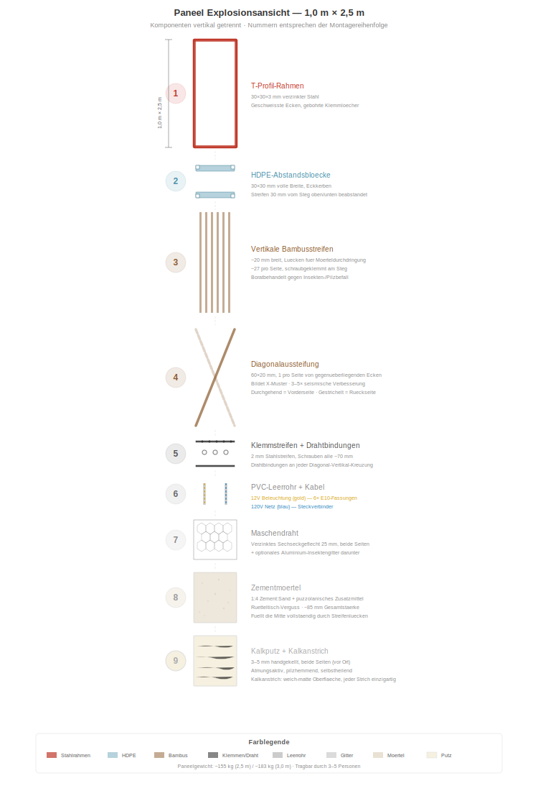
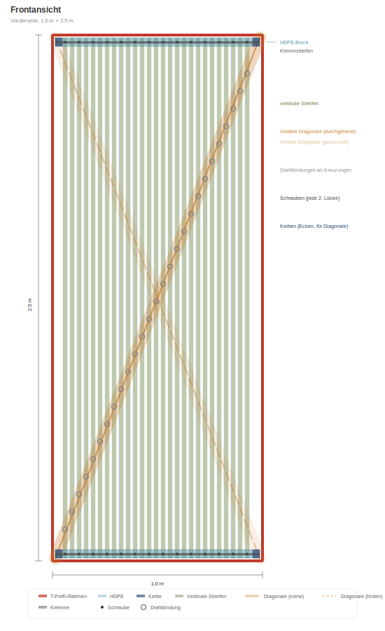
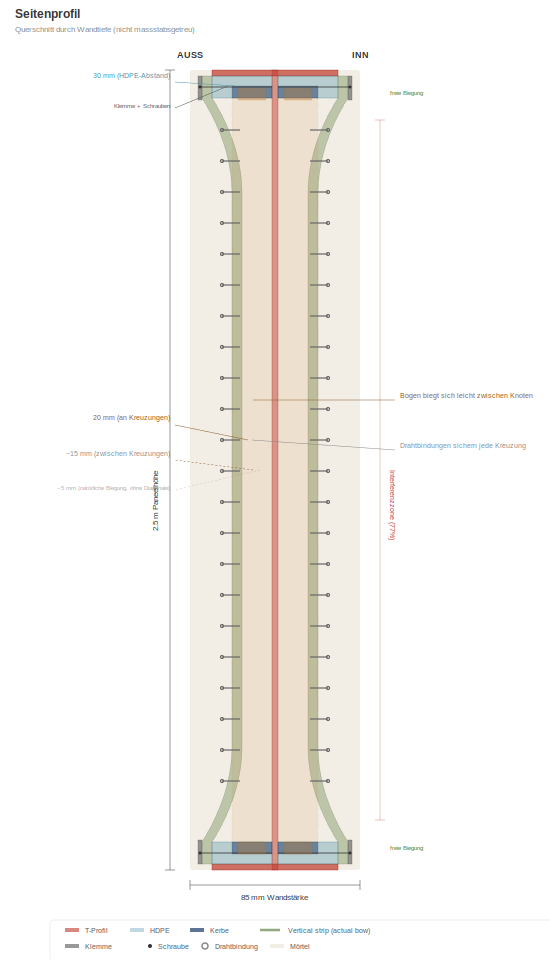
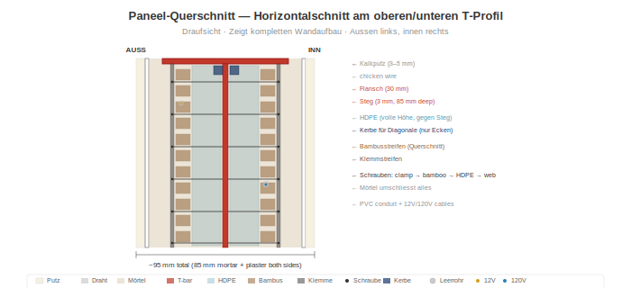

# Paneelaufbau

> **SVG-Aktualisierung ausstehend:** Einige Diagramme in diesem Kapitel werden von der früheren T-Profil-Spezifikation auf die aktuelle **L 40×40×4 mm Winkelprofil**-Spezifikation umgestellt. Einige T-Profil-spezifische SVGs wurden vorübergehend entfernt, bis sie neu erzeugt sind. Siehe [`SVG-STATUS.md`](../SVG-STATUS.md) im Repository-Stammverzeichnis für die vollständige SVG-Neuerzeugungsliste.

## Übersicht

Jedes Wandpaneel ist **1,0 m breit × 2,5 m hoch** (Hochformat). Das Paneelgewicht hängt von der Produktionsphase ab: Eine **Trockenmontage** (Rahmen + Bambus + Gitter + Installationen, vor dem Mörtelguss) wiegt ungefähr **~75 kg** und ist die Form, die von der Werkstatt zur Baustelle geliefert wird, um Mörtel vor Ort zu giessen. Sobald der Mörtel gegossen und ausgehärtet ist und die Vor-Ort-Oberflächen (Putz, Kalkanstrich) aufgebracht sind:

- **Basis-Gewicht der fertigen Wand:** ungefähr **~440 kg** pro Paneel (≈ 176 kg/m²) mit der dokumentierten Standardmischung (30 % Guadua-Anteil im Hohlraum + Zement-Sand-Mörtel + 10 mm Kalkputz auf beiden Seiten).
- **Optimierte Bahareque-Mischung:** ungefähr **~360 kg** pro Paneel (≈ 144 kg/m²) mit puzzolanischem Kalkmörtel mit Pasto-estrella-Fasern + 30 % Guadua + 5 mm Kalkputz auf beiden Seiten. Traditionelle kolumbianische Bahareque-Praxis auf das modulare System übertragen; leicht geringere graue Energie, etwas niedrigere Kosten, volle strukturelle Leistungsfähigkeit erhalten.

Jedes Paneel enthält integrierte Tragstruktur, Isolierung und Elektrosysteme. Eine Grösse. Vier Varianten.

> **Skalierbarkeit:** Die 2,5 m Höhe eignet sich für Standardwohnraumhöhen weltweit. Das System skaliert auf jede Höhe — 3,0 m für hohe Decken, 2,7 m für Gewerberäume, 2,0 m für Trennwände. Nur die vertikalen L-Winkel und Bambusstreifen ändern die Länge. Die Rahmenlehre, das Klemmsystem, der Mörtelprozess und das Elektrolayout bleiben identisch.

## Rahmen: L-Winkel 40×40×4 mm

> _Rahmenprofil-Diagramm ausstehend — SVG-Neuerzeugung für L 40×40×4 noch nicht verfügbar. Siehe `SVG-STATUS.md`._

Der Paneelrahmen ist ein handelsüblicher L-Winkel (warmgewalztes gleichschenkliges Winkelprofil, ASTM A36 / ICONTEC-Äquivalent, feuerverzinkt):

- **Profil:** L 40×40×4 mm (beide Schenkel 40 mm breit, 4 mm dick)
- **Ein Schenkel (Flansch):** 40 mm × 4 mm — zeigt nach aussen, bündig mit der Mörteloberfläche
- **Anderer Schenkel (Steg):** 40 mm × 4 mm — ragt nach innen, bietet strukturelle Tiefe und Klemmfläche für Bambusstreifen und Gitter
- **Wandstärke:** ~85 mm (der L-Winkel-Steg sitzt im Mörtelkern, Mörtel füllt ~41 mm beiderseits der Stegebene)
- **Ecken:** Auf Gehrung 45° geschnitten und in einer Lehre geschweisst — alle Rahmen identisch. Optionale Eckbleche für zusätzliche Steifigkeit
- **Klemmlöcher:** Alle ~70 mm entlang der oberen und unteren Schenkel gebohrt (ein Loch pro zwei Bambusstreifen). Bambus-Klemmleisten (Flachstahl 40×3) werden an diesen Löchern verschraubt
- **Verfügbarkeit:** Massenartikel, weltweit bei jedem grösseren Stahlhändler verfügbar. In Kolumbien: Gerdau Diaco, Aceros Arequipa, Acesco, Ferrasa, Colmena/Sidenal. In 6-m-Stangen vorrätig, mit Trennschleifer auf Mass geschnitten. Keine Sonderanfertigung, keine asymmetrischen Stege
- **Warum L-Winkel statt T-Profil:** Strukturell gleichwertig für den dauerhaft im Mörtel eingebetteten Rahmen (siehe [Tragverhalten](05-tragverhalten.md)), deutlich geringeres Stahlgewicht (~22 kg/Paneel gegenüber ~45 kg bei T 60×60×7), niedrigere Kosten, niedrigere graue CO₂-Emissionen und — entscheidend — als Lagermaterial verfügbar statt als bespoke asymmetrische Anfertigung

Der Rahmen ist das strukturelle Rückgrat. Alles andere wird daran befestigt.

## HDPE-Distanzblöcke

- **Grösse:** 30 × 30 mm Querschnitt, volle 1 m Breite
- **Position:** Auf oberen und unteren L-Winkel-Stegen montiert (2 pro Paneel)
- **Funktion:** Halten die Bambusstreifen oben und unten 30 mm vom Steg fern
- **Eckkerben:** 10 × 10 mm Aussparungen an jeder Ecke verankern die Diagonalstreifen auf Steghöhe
- **Material:** Recyceltes HDPE (aus Platte oder Rohr). Keine Fäulnis, keine Korrosion, formstabil

## Guadua-Vertikalstreifen

- **Material:** Borat-behandelte Guadua angustifolia, in Streifen gespalten
- **Masse:** ~20 mm breit × 2.500 mm lang
- **Abstand:** ~20 mm Lücken zwischen den Streifen (Mörteldurchdringung)
- **Menge:** ~27 Streifen pro Seite, ~54 total pro Paneel
- **Befestigung:** Schraubgeklemmt an den L-Winkel-Steg oben und unten über Klemmleisten

### Das )( Profil

Oben und unten halten die HDPE-Blöcke die Streifen 30 mm vom Steg entfernt. Auf halber Höhe biegen sich die Streifen natürlich nach innen zum Steg — wodurch ein **)(** Querschnittprofil entsteht. Das ist kein Fehler; es ist das Design:

- Der Mörtel füllt den variierenden Spalt und erzeugt eine natürliche Bogenform
- Der Bogen widersteht Kräften senkrecht zur Wandebene (Wind, Stoss)
- Der Mörtel mit variabler Dicke verankert die Streifen mechanisch

## Bambus-Diagonalstreifen

- **Masse:** 60 × 20 mm, ~2.690 mm lang (Ecke zu Ecke diagonal)
- **Menge:** 1 pro Seite, von gegenüberliegenden Ecken (bildet ein X von vorne betrachtet)
- **Position:** Verläuft auf Steghöhe, durch die HDPE-Block-Eckkerben gefädelt
- **Vorgespannt:** Vor dem Befestigen stramm gezogen
- **Funktion:** Wandelt seismische Scherkräfte in Zug in der Diagonale um. Bietet **3–5× Verbesserung der Schubsteifigkeit** gegenüber Paneelen ohne Diagonalen.

### Drahtbindungen

Verzinkte Drahtbindungen an jeder Diagonal-Vertikal-Kreuzung (~8–10 pro Seite). Diese verriegeln die vertikalen und diagonalen Streifen zu einem starren Gitter, verteilen Punktlasten über die gesamte Paneelfläche und erzeugen ein duktiles Versagensmuster.

## PVC-Leerrohr

- **Grösse:** 16 mm Standard-Elektroleerrohr
- **Position:** Zwischen den Bambusstreifen, am Steg anliegend
- **Funktion:** Schützt 12V- und 120V-Kabel vor Mörtel und Schraubendruck. Ermöglicht Kabelaustausch durch Einziehen neuer Leitungen, ohne das Paneel zu öffnen.

## Elektrosysteme

Jedes Paneel enthält zwei unabhängige Stromkreise:

### 12V Beleuchtung
- 2-adriges Kabel im PVC-Leerrohr
- 6× E10-Schraubfassungen (3 pro Seite) nahe dem oberen Paneelrand
- Warmtonige Glüh- oder LED-Lampen (0,5–1W pro Stück) — Wandflutbeleuchtung
- 2-polige Snap-Stecker an beiden Vertikalkanten

### 120V Netz (je nach Variante)
- 3-adriges Kabel (L + N + PE) im PVC-Leerrohr
- 3-polige Snap-Stecker an beiden Vertikalkanten
- Wenn Paneele nebeneinander verschraubt sind, rasten die Stecker zusammen = durchgehender Stromkreis

## Paneelvarianten

| Typ | Anteil | Inhalt |
|-----|--------|--------|
| **P** — Durchleitung | ~60% | 12V Beleuchtung + 120V Durchleitungskabel. Keine Steckdosen. |
| **O** — Steckdose | ~18% | 12V Beleuchtung + Doppelsteckdose auf ~40 cm Höhe |
| **S** — Schalter + Steckdose | ~9% | 12V Beleuchtung + Schalter auf ~120 cm + Steckdose auf ~40 cm |
| **W** — Wasser + Steckdose | ~13% | 12V Beleuchtung + Steckdose + Kalt-/Warmwasser-Steigleitungen + Grauwasserabfluss |

Alle Varianten teilen denselben Rahmen, dieselbe Bambus-Ausfachung, denselben Mörtel. Nur die eingebetteten Installationen unterscheiden sich.

## Mörtel

- **Mischung:** 1:4 Portlandzement : sauberer Flusssand
- **Zusätze:** Polypropylenfaser (6–12 mm) zur Rissverhinderung in der Aushärtungsphase + puzzolanischer Zusatz (Vulkanasche, Reishülsenasche oder Metakaolin)
- **Auftrag:** Verguss auf Rütteltisch (siehe [Bauprozess](04-bauprozess.md))
- **Gesamte Wanddicke:** ~85 mm (Mörtel + Guadua + Mörtel)
- **Das Puzzolan** reduziert den Mörtel-pH-Wert über die Zeit und verlangsamt den Abbau des eingebetteten Bambus

## Deckschichten (auf der Baustelle nach der Installation aufgetragen)

1. **Hühnerdrahtgeflecht** — verzinktes Sechseckgeflecht (25 mm Maschenweite), auf beide Seiten geklammert. Bietet mechanischen Verbund für die Mörtel-/Putzhaftung.
2. **Feines Aluminiumgitter** (optional) — Standard-Insekten-/Staubschutzgitter, 1–1,5 mm Maschenweite. Blockiert Insekten, Feinstaub und Pollen am Eindringen durch die Mörtelmatrix. Als sekundäre Eigenschaft bietet die Aluminiumschicht auch messbare Hochfrequenzdämpfung.
3. **Kalkputz** — 3–5 mm, handgeglättet. Atmungsaktiv, antimykotisch, selbstheilend. Optional: gehäckselte getrocknete Grasfaser für Rissbeständigkeit.
4. **Kalkanstrich** — Kalk + Wasser, mit Pinsel aufgetragen. Sanftes mattes Finish. Jeder Pinselstrich einzigartig.

## Gewichtsaufschlüsselung (ungefähr)

| Komponente | Gewicht |
|-----------|---------|
| Stahlrahmen | ~18 kg |
| HDPE-Blöcke | ~1 kg |
| Bambusstreifen + Diagonalen | ~12 kg |
| Mörtel (85 mm × 1 m × 2,5 m) | ~120 kg |
| Draht, Gitter, Leerrohr, Kabel | ~6 kg |
| **Total** | **~155 kg** |

Tragbar von 3–4 Personen mit einer einfachen Tragelehre.
