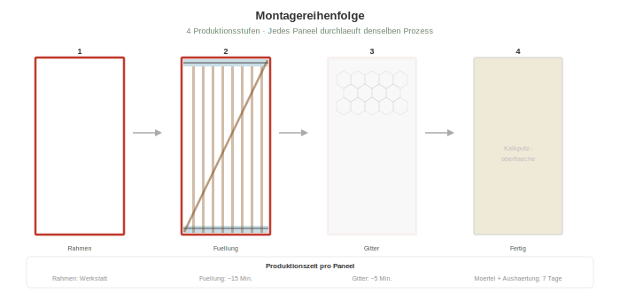
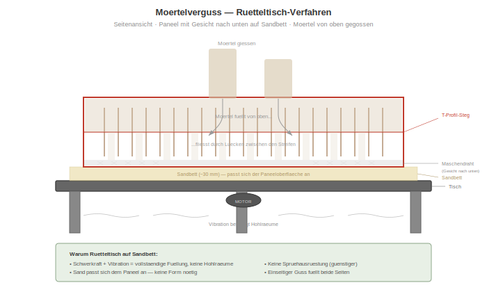

# Bauprozess

> **SVG-Aktualisierung ausstehend:** Einige Diagramme in diesem Kapitel wurden für die frühere T-Profil-Rahmenspezifikation erzeugt und sind vorübergehend entkoppelt, bis sie für die aktuelle **L 40×40×4 mm Winkel**-Spezifikation neu erzeugt sind. Siehe [`SVG-STATUS.md`](../SVG-STATUS.md) im Repository-Stammverzeichnis.

## Werkstatteinrichtung

Alle Paneele werden in einer überdachten Werkstatt gebaut — wetterunabhängig, qualitätskontrolliert, fliessbandeffizient. Mindestanforderungen an die Werkstatt:

- Überdachte Fläche: ~6 × 4 m (Dach, offene Seiten akzeptabel)
- Schweissstation (nur für Rahmenfertigung)
- Ständerbohrmaschine oder Handbohrmaschine
- 2× Rütteltische (~1,2 × 2,7 m pro Stück) für das Werkstatt-Verguss-Produktionsmodell, **oder** Schalung + Vor-Ort-Mörtelpumpe für das bevorzugte Vor-Ort-Verguss-Modell (siehe [Paneelaufbau § Gewichtsaufschlüsselung](02-paneel-aufbau.md))
- Sandvorrat für Bett
- Mörtelmischer (elektrisch oder von Hand)
- Einfaches Handwerkzeug: Schraubenzieher, Drahtschneider, Zangen, Klammergerät

## Produktionsschritte

### Schritt 1: Rahmenfertigung

> _Wandpaneel-Rahmen-Diagramm ausstehend — die frühere Rahmen-SVG zeigt T-Profil-Geometrie und ist nicht repräsentativ für den L-Winkelrahmen. Siehe `SVG-STATUS.md`._

1. L 40×40×4 Winkel auf Länge schneiden: 2× 1,0 m (oben/unten) + 2× 2,5 m (Seiten). Lagermaterial von Gerdau Diaco / Acesco / Ferrasa, 6-m-Stangen
2. Ecken auf 45° auf Gehrung schneiden (oder gerade schneiden mit einem Schenkel über dem anderen — beides ergibt einen sauberen rechteckigen Rahmen)
3. Ecken in einer Lehre schweissen — alle Rahmen identisch. Optionale kleine Eckbleche (60×60×3 Blech) können über jede Innenecke geschweisst werden für Steifigkeit beim Handhaben
4. Klemmlöcher alle ~70 mm entlang der oberen und unteren Winkel-Stege bohren (eines pro zwei Bambusstreifen, ~14 Löcher pro Leiste, ~28 total)
5. Den fertigen Rahmen feuerverzinken (Chargenprozess — 20–50 Rahmen auf einmal versenden)

**Alle Rahmen sind identisch, unabhängig von der Paneelvariante.** Die Lehre gewährleistet konsistente Masse. Eine Lehre, ein Rahmen, für immer.

### Schritt 2: HDPE-Blöcke

1. HDPE-Material auf 30 × 30 mm × 1.000 mm zuschneiden (2 pro Paneel)
2. Eckkerben schneiden: 10 × 10 mm an jedem Ende (4 Kerben pro Block, 8 pro Paneel)
3. Blöcke auf obere und untere L-Winkel-Stege montieren mit Schrauben oder Klebstoff

### Schritt 3: Elektrik

1. 12V-Kabel durch PVC-Leerrohr führen
2. 120V-Kabel durch separates PVC-Leerrohr führen
3. E10-Fassungen montieren (3 nahe am oberen Rand, jede Seite)
4. Für Typ O/S: Steckdosendose montieren, Anschlusskabel zum Hauptkabel
5. Für Typ S: Schalterdose auf 120 cm Höhe montieren
6. Für Typ W: Wasser-Steigleitungen montieren (CPVC/PEX-Versorgung, PVC-Abfluss) mit verschlossenen Anschlussstutzen
7. Snap-Stecker an beiden Vertikalkanten anbringen (2-polig für 12V, 3-polig für 120V)

### Schritt 4: Bambusstreifen (Seite 1)

1. Paneelrahmen flach auf Arbeitstisch legen, Seite 1 nach oben
2. Vertikale Bambusstreifen gegen den Steg legen, zwischen den HDPE-Blöcken
3. ~20 mm Lücken zwischen den Streifen lassen für Mörteldurchdringung
4. PVC-Leerrohr mit Kabeln zwischen die Streifen legen, am Steg anliegend
5. Diagonalstreifen durch die untere linke HDPE-Kerbe fädeln, quer zur oberen rechten Kerbe (auf Steghöhe)
6. Diagonale vorspannen und an beiden Enden sichern

> _Schraubklemm-Diagramm ausstehend — die frühere Klemm-SVG zeigt T-Profil-Steggeometrie; das L-Winkel-Klemmdetail ist im Prinzip ähnlich (Klemmleiste → Bambus → Schraube durch Steg), aber geometrisch anders. Siehe `SVG-STATUS.md`._

### Schritt 5: Schraubklemmung (Seite 1)

1. Stahl-Klemmleiste (Flachstahl 3 mm × 40 mm × 1.000 mm) über die Bambusstreifen am oberen Winkel-Steg legen
2. Löcher in der Klemmleiste mit Löchern im L-Winkel-Steg ausrichten
3. Edelstahlschrauben eindrehen durch: Klemmleiste → Bambusstreifen → Steglöcher
4. Die Klemmleiste biegt sich, um natürliche Dickenvariation auszugleichen — selbstjustierend
5. Am unteren Winkel wiederholen
6. Diagonale an jeder Vertikalstreifen-Kreuzung mit Draht binden (~8–10 Bindungen)

**Zeit: ~5 Minuten pro Seite für die Klemmung, ~3 Minuten für die Drahtbindungen**

### Schritt 6: Wenden und wiederholen (Seite 2)

1. Paneel wenden
2. Schritte 4–5 auf der anderen Seite wiederholen
3. Diagonale auf Seite 2 verläuft von oben links nach unten rechts (gegenüber der Diagonalen auf Seite 1 — zusammen bilden sie ein X)

### Schritt 7: Gitter

1. Hühnerdraht über Seite 1 legen, 20 mm über den Rahmenrand hinausragend (für Überlappung mit benachbarten Paneelen)
2. Am Rahmen und an den Bambusstreifen klammern oder binden
3. Bei Verwendung von Aluminium-Insektengitter: unter dem Hühnerdraht platzieren
4. Wenden und auf Seite 2 wiederholen

### Schritt 8: Mörtelverguss

Dies ist die zentrale Innovation in der Anwendungsmethode:

1. **Rütteltisch vorbereiten:** Ebene Fläche, Motor darunter montiert
2. **Sandbett ausbreiten:** ~30 mm sauberer, trockener Sand auf der Tischfläche. Der Sand passt sich allen Unregelmässigkeiten der Paneelfläche an und verhindert das Anhaften des Mörtels am Tisch.
3. **Paneel mit der Vorderseite nach unten** auf das Sandbett legen (Hühnerdrahtseite berührt Sand)
4. **Mörtel mischen:** 1:4 Zement:Sand + PP-Faser + puzzolanischer Zusatz, W/Z ~0,45–0,50 (giessfähig aber nicht flüssig)
5. **Mörtel über die offene Rückseite** des Paneels giessen, Lücken zwischen Streifen füllen und das Gitter bedecken
6. **Vibration starten:** Tisch 30–60 Sekunden laufen lassen. Die Vibration:
   - Treibt Mörtel durch die Lücken zwischen den Streifen
   - Füllt den zentralen Hohlraum vollständig
   - Eliminiert Hohlräume und Lufteinschlüsse
   - Mörtel dringt bis zum Frontflächengitter vor (das jetzt auf Sand liegt)
7. **Abziehen** — überschüssigen Mörtel bündig mit den Rahmenkanten abstreichen
8. **Glätten** (dies wird die Innenseite)

> **Rütteltisch-Bauanleitung:** Eine DIY-Rütteltisch-Konstruktion (Motor, Plattform, Federn) wird in diesem Repository veröffentlicht, sobald das Design getestet und als sicher bestätigt wurde. Bis dahin funktioniert jede flache Plattform mit einem Betonrüttler, der an der Kante befestigt wird, für erste Versuche.

**Warum Rütteltisch auf Sandbett?**
- Schwerkraft + Vibration = vollständige Füllung, keine Hohlräume
- Sandbett = keine Form nötig, Sand passt sich der Paneelform an
- Keine Sprühausrüstung nötig (günstiger als Sprühmörtel)
- Einseitiger Verguss füllt beide Seiten — Mörtel fliesst durch die Streifenlücken
- Gleichbleibende Qualität — Vibration eliminiert menschliche Fehler

### Schritt 9: Aushärtung

1. Paneel mit Plastikfolie abdecken, um Feuchtigkeit zu halten
2. Mindestens 7 Tage feucht halten (Sprühnebel oder feuchte Jutesäcke)
3. Volle Festigkeit nach 28 Tagen
4. Paneele können nach 7 Tagen vertikal (hochkant) gestapelt werden, um Platz zu sparen
5. Jedes Paneel mit Variantentyp und Produktionsdatum beschriften

**Produktionsrate: 3–4 Paneele pro Tag** mit 2 parallel laufenden Rütteltischen, Team von 4–6 Personen. Aktive Arbeit pro Paneel: ~15–20 Minuten. Passive Aushärtung: 7–28 Tage (Paneele härten aus, während neue produziert werden).

### Schritt 10: Transport und Installation

1. Paneele zur Baustelle transportieren mittels einfachem A-Rahmen-Wagen oder Lastwagen
2. Paneele in den Stahlgebäuderahmen an den Stützenpositionen verschrauben (vorgeschweisste Schraubwinkel an Stützen)
3. Benachbarte Paneele berühren sich Mörtel an Mörtel
4. Snap-Connect-Elektrik zwischen benachbarten Paneelen verbinden (12V + 120V)
5. Stromkreise vor dem Verputzen testen

### Schritt 11: Fertigstellung vor Ort

1. Fugen zwischen Paneelen mit Mörtel füllen
2. Hühnerdrahtstreifen über Fugen anbringen (falls nicht bereits durch die Paneelränder überlappend)
3. Kalkputz auftragen: 3–5 mm, handgeglättet, beide Seiten
4. Aushärten lassen (3–5 Tage feucht halten)
5. Kalkanstrich auftragen: 2–3 dünne Schichten mit Pinsel

Die fertige Wand ist fugenlos — keine sichtbaren Fugen, kein sichtbarer Stahl, keine sichtbaren Schrauben. Nur glatter Kalkputz mit der Textur einer handgefertigten Wand.

### Schritt 12: Bad-Abdichtung

Bad- und Duschbereiche erfordern eine wasserdichte Behandlung anstelle von Kalkputz:

1. **Duschwände:** Flüssige Abdichtungsmembran (Sika-1 oder ähnlich) direkt auf die Mörtel-Paneelfläche auftragen — 2 Anstriche, mit Pinsel. Dann flexibler Fliesenkleber + Keramik-/Porzellanfliesen. **Kein Kalkputz im Duschbereich.**
2. **Badezimmerboden (gesamt):** Abdichtungsmembran auf der Plattenoberfläche + Keramikfliesen. Die Platte muss ein Gefälle von 2 % zum Bodenablauf aufweisen (während des Plattengusses geformt).
3. **Badezimmerwände ausserhalb der Dusche:** Kalkputz ist akzeptabel, oder Fliesen für leichte Reinigung.
4. **Decke (unter Galerie):** Kalkputz — nicht direkt besprüht.

Die Mörtel-Paneeloberfläche bietet ausgezeichnete Haftung für die Flüssigmembran — keine zusätzliche Vorbereitung nötig. Einfach die Paneelfläche reinigen und auftragen.

### Entwässerung (in der Platte geplant)

Alle Entwässerungen müssen VOR dem Guss der Fundamentplatte installiert werden:

- **Toilettenabfluss:** 4" (100 mm) PVC-Rohr zur Klärgrube. Position ist fix — kann später nicht verschoben werden.
- **Duschbodenablauf:** 2" (50 mm) PVC mit Geruchsverschluss. Platte im Duschbereich um ~20 mm vertieft, um Wasser zurückzuhalten.
- **Spülbeckenabflüsse:** 1,5" (40 mm) PVC mit Geruchsverschluss. Spülbecken Küche durch die Platte; Waschbecken Bad durch das W-Typ-Wasserpaneel oder die Platte.
- **Reinigungsöffnung:** Zugängliche Armatur ausserhalb des Gebäudes an der Abflussleitung.

Das W-Typ-Paneel liefert Versorgungs-Steigleitungen (warm/kalt CPVC). Entwässerung ist immer in der Platte — Schwerkraftentwässerung benötigt Gefälle, das Paneele nicht bieten können.

## Qualitätscheckliste

- [ ] Rahmenmasse innerhalb ±2 mm
- [ ] Alle Klemmlöcher gebohrt und ausgerichtet
- [ ] Bambusstreifen Borat-behandelt (grünlich/bläulicher Farbton sichtbar)
- [ ] Diagonale vorgespannt (sollte beim Klopfen klingen)
- [ ] Alle Drahtbindungen straff
- [ ] Elektrostromkreise vor Mörtelverguss getestet (12V und 120V)
- [ ] Mörtelkonsistenz korrekt (Setztest)
- [ ] Vibration volle 30–60 Sekunden gelaufen
- [ ] Keine sichtbaren Hohlräume auf der Vergussseite nach Vibration
- [ ] Paneel mit Typ und Datum beschriftet
- [ ] Mindestens 7 Tage ausgehärtet vor Handhabung
