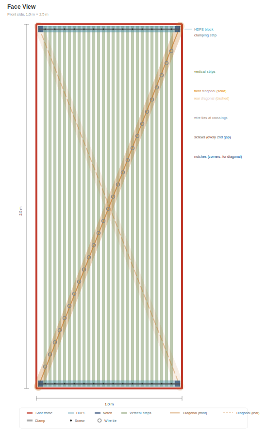
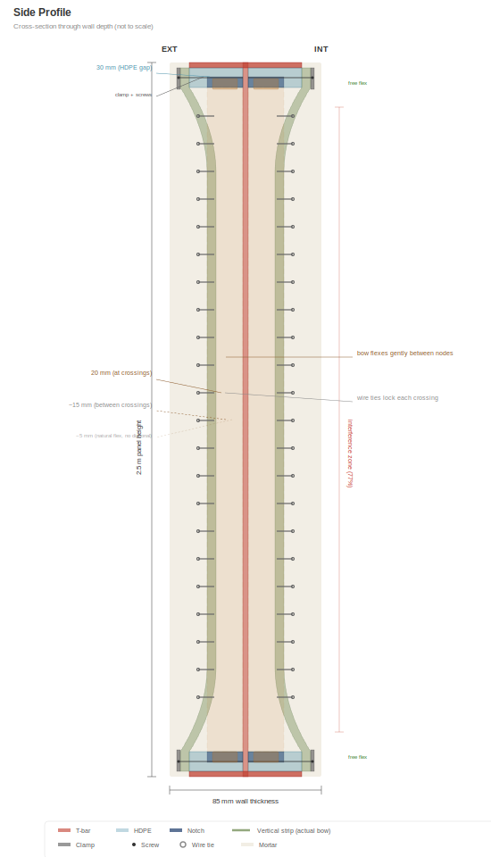

# Panel Anatomy

> **SVG update pending**: this chapter's diagrams are being migrated from the previous T-bar frame spec to the current **L 40×40×4 mm angle** frame spec. Some T-bar-specific SVGs have been temporarily unlinked until regenerated. See [`SVG-STATUS.md`](../SVG-STATUS.md) at the repo root for the full SVG regeneration task list.

## Overview

Every wall panel is **1.0 m wide × 2.5 m tall** (vertical orientation). Panel weight depends on production stage: a **dry assembly** (frame + bamboo + mesh + services, before mortar) weighs approximately **~75 kg** and is the form shipped from workshop to site for in-situ mortar pour. Once the mortar is poured and cured, and on-site finishes (plaster, lime wash) are applied:

- **Baseline finished wall weight**: approximately **~440 kg** per panel (≈ 176 kg/m²) using the documented standard mix (30 % guadua content in the cavity + cement-sand mortar + 10 mm lime plaster both faces).
- **Optimized bahareque mix**: approximately **~360 kg** per panel (≈ 144 kg/m²) using pozzolanic lime mortar with pasto estrella fibers + 30 % guadua + 5 mm lime plaster both faces. Traditional Colombian bahareque practice adapted to the modular system; slightly lower embodied carbon, slightly lower cost, full structural capacity retained.

Each panel contains integrated structure, insulation, and electrical systems. One size. Four variants.

> **Scalability:** The 2.5 m height suits standard residential ceiling heights worldwide. The system scales to any height — 3.0 m for high ceilings, 2.7 m for commercial spaces, 2.0 m for partitions. Only the vertical T-bars and bamboo strips change length. The frame jig, clamping system, mortar process, and electrical layout remain identical.

## Frame: L-angle 40×40×4 mm

> _Frame profile diagram pending — SVG regeneration for L 40×40×4 not yet available. See `SVG-STATUS.md`._

The panel frame is a standard commercial L-angle (hot-rolled equal-leg angle, ASTM A36 / ICONTEC equivalent, hot-dip galvanized):

- **Profile:** L 40×40×4 mm (both legs 40 mm wide, 4 mm thick)
- **One leg (flange):** 40 mm × 4 mm — faces outward, flush with the mortar surface
- **Other leg (web):** 40 mm × 4 mm — extends inward, provides structural depth and clamping surface for bamboo strips and mesh
- **Wall thickness:** ~85 mm (the L-angle web sits inside the mortar core, with mortar filling ~41 mm on each side of the web plane)
- **Corners:** Mitre-cut at 45° and welded in a jig — all frames identical. Optional corner gussets for added rigidity
- **Clamping holes:** Drilled every ~70 mm along the top and bottom angle webs (one hole per two bamboo strips). Bamboo-clamping strips (flat bar 40×3) bolt to these holes
- **Availability:** Commodity item stocked by every major Colombian steel distributor (Gerdau Diaco, Aceros Arequipa, Acesco, Ferrasa, Colmena/Sidenal). 6 m standard lengths, cut to size with a chop saw. No custom steel fabrication, no special-order geometry
- **Why L-angle, not T-bar:** structurally equivalent for a continuously-braced embedded frame (see [Structural Performance](05-structural-performance.md)), significantly lower steel mass (~22 kg/panel vs ~45 kg for T 60×60×7), lower cost, lower embodied CO₂, and — crucially — available as stock inventory rather than as a bespoke asymmetric fabrication

The frame is the structural backbone. Everything else attaches to it.

## HDPE Spacer Blocks

- **Size:** 30 × 30 mm cross-section, full 1 m width
- **Position:** Mounted on top and bottom T-bar webs (2 per panel)
- **Function:** Space bamboo strips 30 mm away from the web at top and bottom edges
- **Corner notches:** 10 × 10 mm cutouts at each corner anchor the diagonal strips at web level
- **Material:** Recycled HDPE (from sheet or pipe). Zero rot, zero corrosion, dimensionally stable

## Guadua Vertical Strips

- **Material:** Borate-treated Guadua angustifolia, split into strips
- **Dimensions:** ~20 mm wide × 2,500 mm long
- **Spacing:** ~20 mm gaps between strips (mortar penetration)
- **Quantity:** ~27 strips per side, ~54 total per panel
- **Attachment:** Screw-clamped to the T-bar web at top and bottom via clamping strips

### The )( Profile

At the top and bottom, the HDPE blocks hold the strips 30 mm from the web. At mid-height, the strips flex naturally inward toward the web — creating a **)(** cross-section profile. This is not a defect; it is the design:

- The mortar fills the varying gap, creating a natural arch shape
- The arch resists out-of-plane forces (wind, impact)
- The variable thickness mortar locks the strips mechanically

## Bamboo Diagonal Strips

- **Dimensions:** 60 × 20 mm, ~2,690 mm long (corner to corner diagonal)
- **Quantity:** 1 per side, from opposing corners (forms an X when viewed from front)
- **Position:** Runs at web level, threaded through the HDPE block corner notches
- **Pre-tensioned:** Pulled tight before securing
- **Function:** Converts seismic shear forces to tension in the diagonal. Provides **3–5× improvement in racking resistance** over panels without diagonals.

### Wire Ties

Galvanized wire ties at every diagonal-vertical crossing (~8–10 per side). These lock the vertical and diagonal strips into a rigid grid, distributing point loads across the entire panel face and creating a ductile failure mode.

## PVC Conduit

- **Size:** 16 mm standard electrical conduit
- **Position:** Between bamboo strips, against the web
- **Function:** Protects 12V and 120V cables from mortar and screw pressure. Allows cable replacement by pulling new wire through without opening the panel.

## Electrical Systems

Each panel contains two independent circuits:

### 12V Lighting
- 2-core cable in PVC conduit
- 6× E10 screw sockets (3 per side) near the top of the panel
- Warm incandescent or LED bulbs (0.5–1W each) — wall wash lighting
- 2-pin snap connectors at both vertical edges, **~50 mm below panel top**

### 120V Mains (per variant)
- 3-core cable (L + N + G) in PVC conduit
- 3-pin snap connectors at both vertical edges, **~50 mm below panel top**
- When panels are bolted adjacent, connectors click together = continuous circuit

### Connector Placement

All electrical connectors are at the **top** of the panel, ~50 mm below the upper edge. This position:

- Keeps connectors away from floor-level moisture (the panel base sits in a foundation channel)
- Hides connectors behind the ring beam or ceiling junction — not visible in the finished wall
- Allows inspection and maintenance from above without removing wall finishes
- Makes connection during installation easy — workers connect while standing, before the floor panel or ring beam is placed
- Places wall connectors at the same level as the floor panel services (electrical conduit, water pipes) — all service connections converge in one accessible zone at the wall-floor junction

## Panel Variants

| Type | Share | Contents |
|------|-------|----------|
| **P** — Pass-through | ~60% | 12V lighting + 120V pass-through cable. No outlets. |
| **O** — Outlet | ~18% | 12V lighting + duplex outlet at ~40 cm height |
| **S** — Switch + Outlet | ~9% | 12V lighting + switch at ~120 cm + outlet at ~40 cm |
| **W** — Water + Outlet | ~13% | 12V lighting + outlet + cold/hot water risers + grey water drain |

All variants share the same frame, same bamboo infill, same mortar. Only the embedded services differ.

## Mortar

- **Mix:** 1:4 Portland cement : clean river sand
- **Additives:** Polypropylene fiber (6–12 mm) for curing-phase crack prevention + pozzolanic admixture (volcanic ash, rice husk ash, or metakaolin)
- **Application:** Poured on vibration table (see [Construction Process](04-construction-process.md))
- **Total wall thickness:** ~85 mm (mortar + guadua + mortar)
- **The pozzolan** reduces mortar pH over time, slowing degradation of embedded bamboo

> _Panel cross-section diagram pending — the previous cross-section SVG shows T-bar geometry and is not representative of the current L 40×40×4 spec. See `SVG-STATUS.md`._

## Finish Layers (applied on-site after installation)

1. **Chicken wire mesh** — galvanized hexagonal mesh (25 mm opening), stapled to both faces. Provides mechanical key for mortar/plaster adhesion.
2. **Fine aluminum mesh** (optional) — standard insect/dust screen, 1–1.5 mm opening. Blocks insects, fine dust, and pollen from entering through the mortar matrix. As a secondary property, the aluminum layer also provides measurable radio-frequency attenuation.
3. **Lime plaster** — 3–5 mm, hand-troweled. Breathable, antifungal, self-healing. Optional: chopped dried grass fiber for crack resistance.
4. **Lime wash** — cal + water, brush-applied. Soft matte finish. Each brush stroke unique.
5. **Rounded exterior corners** — quarter-split guadua culm (⌀85 mm → ~42 mm radius), wire-tied at building corners. Chicken wire wraps continuously around the curve. Lime plaster hand-troweled over the mesh creates a soft, organic radius at every exterior corner. Traditional bahareque finish — no two corners identical. See Building Integration chapter for detail.

## Weight Breakdown (approximate)

Panel weights differ at each production stage. The system is designed so the **dry assembly** can be transported and positioned by two people, with mortar and finishes added on-site via in-situ vertical pour — keeping handling weight minimal without sacrificing final wall mass for thermal, acoustic, and structural performance.

All figures below assume the current **L 40×40×4 mm angle frame** spec. For historical context: earlier versions of this document spec'd a T 60×60×7 mm frame (~45 kg steel per panel); the L-angle revision saves ~23 kg of steel per panel at equivalent structural capacity for continuously-braced-in-mortar service.

### Dry assembly — panel as shipped from workshop (~75 kg)

Before any mortar. This is the panel that leaves the workshop and arrives at the building site, ready to receive mortar via in-situ vertical pour against formwork (see [Construction Process](04-construction-process.md)).

| Component | Weight |
|-----------|--------|
| Steel L-angle frame (L 40×40×4, 7 m at 2.42 kg/m) | ~17 kg |
| Clamping strips (flat bar 40×3, ~4 m at 0.94 kg/m) | ~4 kg |
| Corner gussets + fasteners + bolts | ~1 kg |
| **Steel sub-total** | **~22 kg** |
| HDPE blocks | ~1 kg |
| Bamboo strips + diagonals (30 % cavity density — ~0.06 m³ × 700 kg/m³) | ~42 kg |
| Chicken wire mesh (stapled both faces in workshop) | ~1.5 kg |
| Wire, conduit, cables | ~6 kg |
| Misc (staples, screws) | ~3 kg |
| **Total dry assembly weight** | **~75 kg** |

> **Handling**: at ~75 kg, the dry assembly is lifted and positioned by **two people with a webbing strap** — no crane, no carrying jig required. This is a major operational advantage of the in-situ pour model vs. workshop-poured panels that arrive on site at full cured weight (~360–440 kg, requiring mechanical handling).

### Finished wall weight — baseline and optimized specs

After the mortar is poured in-situ against formwork, cured, and all on-site finish layers applied.

#### Baseline — standard documented mix (~440 kg finished)

The default specification used throughout this document for structural, cost, and environmental analysis. 30 % guadua content in the cavity (denser esterilla weave + horizontal culms + diagonals — traditional bahareque density) with standard cement-sand mortar and 10 mm lime plaster both faces.

| Component | Weight |
|-----------|--------|
| Dry assembly (as above) | ~75 kg |
| Cement-sand mortar (0.147 m³ net cavity × ~2 000 kg/m³ cured) | ~294 kg |
| Lime plaster (10 mm each face, ~1 800 kg/m³, 0.05 m³ total) | ~90 kg |
| Lime wash (both faces) | ~3 kg |
| **Total finished wall weight** | **~462 kg** (≈ 185 kg/m²) |
| Rounded working figure used elsewhere in the document | **~440 kg** (≈ 176 kg/m²) |

> Net cavity calculation: gross 0.2125 m³ − L-angle steel 0.003 m³ − 30 % guadua 0.063 m³ = **~0.147 m³** net for mortar.

For comparison: a 150 mm concrete block wall is ~180 kg/m². The panel system at baseline is **roughly equivalent** to conventional masonry in weight per unit area, with far better thermal mass per kg of material, better seismic behavior due to the steel frame, and dramatically lower embodied carbon.

#### Optimized bahareque mix (~360 kg finished)

Traditional Colombian bahareque practice applied to the modular system: pozzolanic lime mortar (30 % fly ash or rice husk ash replacement for Portland cement), pasto estrella (dried star grass) fibers in the mortar for crack resistance, and thinner 5 mm lime plaster. All structural properties maintained; thermal mass slightly reduced; cost slightly lower; embodied carbon meaningfully reduced.

| Component | Weight |
|-----------|--------|
| Dry assembly (same as baseline) | ~75 kg |
| Pozzolanic lime mortar with pasto estrella fibers (0.147 m³ net × ~1 750 kg/m³) | ~257 kg |
| Lime plaster (5 mm each face, ~1 800 kg/m³, 0.025 m³ total) | ~45 kg |
| Lime wash (both faces) | ~3 kg |
| **Total finished wall weight** | **~380 kg** (≈ 152 kg/m²) |
| Rounded working figure used elsewhere in the document | **~360 kg** (≈ 144 kg/m²) |

At ~150 kg/m², the optimized mix matches traditional adobe-bamboo-lime wall densities documented across Colombia, Ecuador, and Peru for centuries, and is **~20 % lighter** than the 150 mm concrete block reference. Builders targeting minimum embodied carbon and minimum foundation load should prefer this spec.

### Handling implications by stage

| Stage | Weight | Handling method |
|-------|--------|-----------------|
| Dry assembly as shipped (~75 kg) | light | **2 people with webbing strap** |
| Post-mortar wet (~400–485 kg depending on mix) | heavy | In-situ — do not move until cured |
| Finished wall — baseline (~440 kg per panel area) | structural dead load | Carried by foundation and frame |
| Finished wall — optimized (~360 kg per panel area) | structural dead load | Carried by foundation and frame |

> **Version note:** Documentation versions up to 0.2.0 stated a total panel weight of ~155 kg. That figure appears to have been based on an arithmetic error in the mortar-density line (implied density ~565 kg/m³ — lightweight-aerated range, not cement-sand or pozzolanic lime mortar). With correct mortar density (~2 000 kg/m³ for cement-sand, ~1 750 kg/m³ for pozzolanic lime with pasto estrella) and the revised L 40×40×4 angle frame spec, the finished panel weighs **~440 kg (baseline) or ~360 kg (optimized)**. The dry-assembly weight (panel as shipped, before mortar) is **~75 kg** — two-person liftable, which matches the original intent of workshop-to-site handling. Builders and structural engineers should use the corrected finished figures for all foundation sizing, seismic dead-load, and transport-of-cured-panel calculations.
