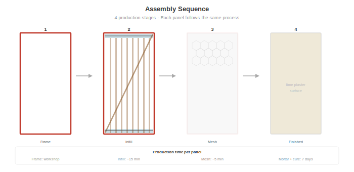
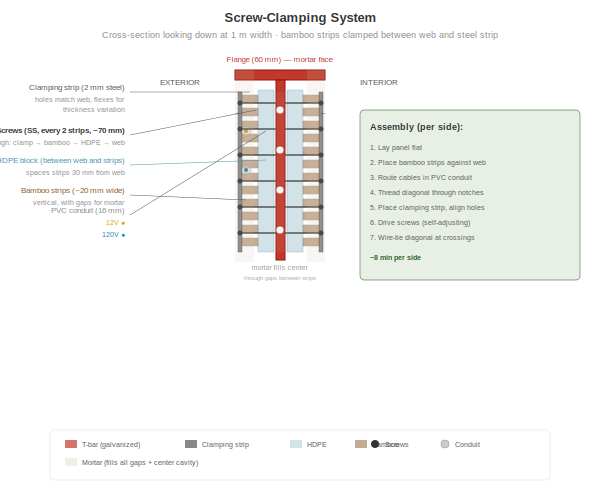

# Construction Process

## Workshop Setup

All panels are built in a covered workshop — weather-independent, quality-controlled, assembly-line efficient. Minimum workshop requirements:

- Covered area: ~6 × 4 m (roof, open sides acceptable)
- Welding station (frame fabrication only)
- Drill press or hand drill
- 2× vibration tables (~1.2 × 2.7 m each)
- Sand supply for bed
- Mortar mixer (electric or hand)
- Basic hand tools: screwdrivers, wire cutters, pliers, staple gun

## Production Steps

### Step 1: Frame Fabrication

1. Cut T-bar to length: 2× 1.0 m (top/bottom, 85 mm web) + 2× 2.5 m (sides, 30 mm web)
2. Weld corners in a jig — all frames identical
3. Drill clamping holes every 100 mm along the top and bottom T-bar webs (10 holes per bar, 20 total)
4. Hot-dip galvanize the completed frame (batch process — send 20–50 frames at once)

**All frames are identical regardless of panel variant.** The jig ensures consistent dimensions. One jig, one frame, forever.

### Step 2: HDPE Blocks

1. Cut HDPE stock to 30 × 30 mm × 1,000 mm (2 per panel)
2. Cut corner notches: 10 × 10 mm at each end (4 notches per block, 8 per panel)
3. Mount blocks on top and bottom T-bar webs using screws or adhesive

### Step 3: Electrical

1. Route 12V cable through PVC conduit
2. Route 120V cable through separate PVC conduit
3. Mount E10 sockets (3 near top, each side)
4. For Type O/S: mount outlet box, wire pigtail to main cable
5. For Type S: mount switch box at 120 cm height
6. For Type W: mount water risers (CPVC/PEX supply, PVC drain) with capped stub-outs
7. Attach snap connectors at both vertical edges (2-pin for 12V, 3-pin for 120V)

### Step 4: Bamboo Strips (Side 1)

1. Place panel frame flat on work table, side 1 up
2. Lay vertical bamboo strips against the web, between the HDPE blocks
3. Leave ~20 mm gaps between strips for mortar penetration
4. Place PVC conduit with cables between strips, against web
5. Thread diagonal strip through bottom-left HDPE notch, across to top-right notch (at web level)
6. Pre-tension diagonal and secure at both ends

### Step 5: Screw-Clamping (Side 1)

1. Place steel clamping strip (2 mm × 30 mm × 1,000 mm) over the bamboo strips at the top T-bar
2. Align holes in clamping strip with holes in T-bar web
3. Drive stainless steel screws through: clamping strip → bamboo strips → web holes
4. The clamping strip flexes to accommodate natural thickness variation — self-adjusting
5. Repeat at bottom T-bar
6. Wire-tie diagonal to each vertical strip at crossings (~8–10 ties)

**Time: ~5 minutes per side for clamping, ~3 minutes for wire ties**

### Step 6: Flip and Repeat (Side 2)

1. Flip panel
2. Repeat steps 4–5 on the other side
3. Diagonal on side 2 runs from top-left to bottom-right (opposing the side 1 diagonal — together they form an X)

### Step 7: Mesh

1. Lay chicken wire over side 1, extending 20 mm past frame edges (for overlap with adjacent panels)
2. Staple or wire-tie to frame and bamboo strips
3. If using aluminum insect mesh: place under chicken wire
4. Flip and repeat on side 2

### Step 8: Mortar Pour

This is the key innovation in application method:

1. **Prepare vibration table:** Level surface, motor mounted underneath
2. **Spread sand bed:** ~30 mm of clean dry sand on the table surface. The sand conforms to any panel face irregularities and prevents mortar adhesion to the table.
3. **Place panel face-down** on the sand bed (chicken wire side touching sand)
4. **Mix mortar:** 1:4 cement:sand + PP fiber + pozzolanic admixture, W/C ~0.45–0.50 (pourable but not liquid)
5. **Pour mortar** over the exposed back of the panel, filling between strips and covering the mesh
6. **Start vibration:** Run table for 30–60 seconds. The vibration:
   - Drives mortar through the gaps between strips
   - Fills the center cavity completely
   - Eliminates voids and air pockets
   - Mortar penetrates to the front face mesh (now resting on sand)
7. **Screed** excess mortar level with the frame edges
8. **Trowel** smooth (this becomes the interior face)

> **Vibration table build guide:** A DIY vibration table design (motor, platform, springs) will be published in this repository once the design has been tested and proven safe in practice. Until then, any flat platform with a concrete vibrator clamped to the edge will work for initial experiments.

**Why vibration table on sand bed?**
- Gravity + vibration = complete fill, no voids
- Sand bed = no mold needed, sand conforms to panel shape
- No spraying equipment needed (cheaper than spray mortar)
- One-sided pour fills both sides — mortar flows through strip gaps
- Consistent quality — vibration eliminates human error

### Step 9: Curing

1. Cover panel with plastic sheet to retain moisture
2. Keep moist for minimum 7 days (mist spray or damp burlap)
3. Full strength at 28 days
4. Panels can be stacked vertically (edge-on) after 7 days to save space
5. Mark each panel with variant type and production date

**Production rate: 3–4 panels per day** with 2 vibration tables running in parallel, team of 4–6 people. Active work per panel: ~15–20 minutes. Passive curing: 7–28 days (panels cure while new ones are produced).

### Step 10: Transport and Installation

1. Transport panels to building site using simple A-frame cart or truck
2. Bolt panels into steel building frame at column positions (pre-welded bolt tabs on columns)
3. Adjacent panels touch mortar-to-mortar
4. Snap-connect electrical between adjacent panels (12V + 120V)
5. Test circuits before finishing

### Step 11: On-Site Finishing

1. Fill any joints between panels with mortar
2. Apply chicken wire mesh over joints (if not already overlapping from panel edges)
3. Apply lime plaster: 3–5 mm, hand-troweled, both faces
4. Allow to cure (keep moist for 3–5 days)
5. Apply lime wash: 2–3 thin coats with brush

The finished wall is seamless — no visible joints, no visible steel, no visible screws. Just smooth lime plaster with the texture of a hand-made wall.

## Quality Checklist

- [ ] Frame dimensions within ±2 mm
- [ ] All clamping holes drilled and aligned
- [ ] Bamboo strips borate-treated (green/blue tint visible)
- [ ] Diagonal pre-tensioned (should ring when tapped)
- [ ] All wire ties tight
- [ ] Electrical circuits tested before mortar (12V and 120V)
- [ ] Mortar consistency correct (slump test)
- [ ] Vibration run for full 30–60 seconds
- [ ] No visible voids on pour face after vibration
- [ ] Panel marked with type and date
- [ ] Cured minimum 7 days before handling
