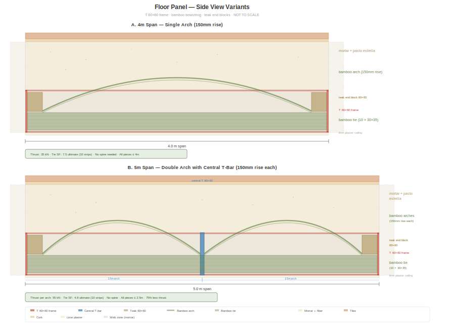
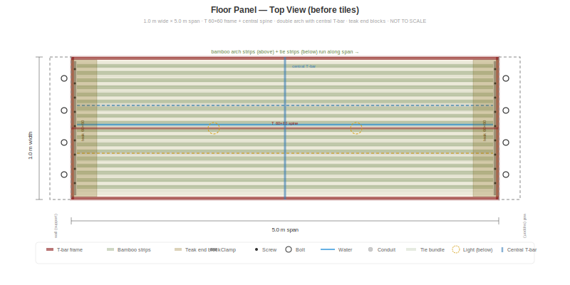

# Floor Panel Concept — Bamboo Bowstring Beam

> **Status: Concept under refinement — not tested.** This document describes a proposed extension of the BaharequeModular panel system for horizontal floor/ceiling spans. All structural estimates are analytical and require lab validation. Contributions, critique, and testing offers are welcome.

## The Goal

Extend BaharequeModular from a wall system to a **complete building system** — walls, floors, and ceilings from the same production line, same materials, same skills. No concrete slab. No steel beams. No rebar.

## The Problem

A standard 85 mm wall panel fails when laid horizontally to span 4–5 m as a floor. The mortar cracks in tension on the bottom face — the panel was designed for compression (walls), not bending (floors).

## The Solution: Bamboo Bowstring Beam

A single T-bar frame (the same part used in wall panels) with a **tied-arch** mechanism inside:

- **Bamboo compression arch** — strips forced into a parabolic curve by graduated perpendicular cross-pieces sitting on top of the T-bar web
- **Bamboo tension tie** — 26 strips (30 × 35 mm) screw-clamped in a single layer across the bottom T-bar flange
- **Mortar** fills and stabilizes everything
- **Minimal steel in the span** — one longitudinal T-bar as central spine, plus perimeter T-bar frame for connections



Each material does what it does best:

| Material | Role | Strength used |
|----------|------|--------------|
| Bamboo arch | Compression | 45 MPa (only 20–31% utilized) |
| Bamboo tie | Tension | 25 MPa at 30% utilization |
| Bamboo cross-pieces | Geometry control | Forces arch into parabolic shape |
| Mortar | Fill + stability | Compression zone above arch |
| T-bar frame | Edge connection | Shear at supports, connection to walls |



## How It Works

A bowstring beam (tied arch) converts the vertical floor load into horizontal thrust. The arch carries this thrust in compression. The tie resists it in tension. The two are in equilibrium — the mortar fills between them, providing stability and distributing local loads.

```
     load (people, furniture)
     ↓ ↓ ↓ ↓ ↓ ↓ ↓ ↓ ↓ ↓ ↓
┌───────────────────────────────┐
│  mortar (compression fill)    │
│   ╭───── bamboo ARCH ─────╮  │ ← compression
│   │    forced up by         │ │
│   │    cross-pieces         │ │
│   ╰─────────────────────────╯ │
│  ════ bamboo TIE ════════════ │ ← tension
└───────────────────────────────┘
     ↑                       ↑
   wall                    wall
```

The arch rise (distance from tie to arch crown) determines how much thrust is generated. A taller arch = less thrust = fewer tie strips needed.

## Specifications (180 mm panel, recommended)

| Property | Value |
|----------|-------|
| Panel dimensions | 1.0 m wide × 4.0 or 5.0 m span |
| Total depth | 180 mm |
| T-bar frame | Standard T 60×60 mm (7 mm thick, 53 mm web) — single frame at bottom |
| Longitudinal T-bar | Standard T 60×60 mm (7 mm thick, 53 mm web) — single bar centered along the span |
| Bamboo arch | 27 strips × 20×20 mm × 2 layers, forced into parabola |
| Cross-pieces | 30×30 mm perpendicular bamboo, graduated 0→40 mm |
| Bamboo tie | 26 strips × 30×35 mm, single layer, screw-clamped (13 per side of longitudinal T-bar) |
| Arch rise | 127 mm (tie to crown) |
| Weight | ~325 kg/m² |

## Structural Performance

| Span | Thrust | Arch ratio | Combined tie ratio | Deflection | Status |
|------|--------|-----------|-------------------|------------|--------|
| 4.0 m | 121 kN | 0.31 (69% reserve) | 0.42 (58% reserve) | 2.2 mm / 13.3 limit | OK |
| 5.0 m | 189 kN | 0.49 (51% reserve) | 0.65 (35% reserve) | 5.0 mm / 16.7 limit | OK |

Floor load: 4.5 kN/m² (dead 2.5 + live 2.0, per NSR-10 residential). Self-weight included.

Combined tie capacity: bamboo tie (205 kN) + longitudinal T-bar in tension (86 kN) = 291 kN.

## Longitudinal T-Bar — Central Spine

A single standard T-bar (T 60×60 mm (7 mm thick, 53 mm web)) runs the full span length, centered in the 1 m width, positioned 10 mm above the bottom panel surface. This converts the panel from a pure bowstring into a hybrid bowstring + reinforced beam.

```
CROSS-SECTION (looking along span):

    ←────────── 1,000 mm ──────────→
    ┌──────────────────────────────────┐
    │           mortar                 │
    │    ╭──── bamboo arch ────╮       │  180 mm
    │    │                     │       │
    │    ╰─────────────────────╯       │
    │  ═ tie ═══ ┬─┤ ═══ tie ═════    │
    │            │w│                   │  ← longitudinal T-bar
    │         ┌──┴─┴──┐                │     10 mm from bottom
    └─────────┘flange └────────────────┘
              ←30mm→
         13 strips    13 strips
         each side    each side
```

### Why It Matters

The bamboo tie alone carries 205 kN — at a 5 m span with 189 kN of thrust, that is 98% utilization (2% reserve). This is the weakest link in the entire panel.

The longitudinal T-bar adds 86 kN of steel tension capacity (345 mm² × 250 MPa yield), bringing the combined capacity to 291 kN — a **42% increase** for just 13.5 kg of steel.

| | Bamboo tie only | Bamboo tie + T-bar |
|---|---|---|
| Tension capacity | 205 kN | 291 kN |
| Tie ratio (5 m) | 0.98 | 0.65 |
| Safety factor (5 m) | 2.04 | 2.90 |

### Additional Benefits

- **Redundancy** — hybrid system: if the bowstring mechanism partially fails, the T-bar alone carries 78% of the required bending moment as a reinforced beam
- **Deflection** — steel stiffness (E = 200 GPa) significantly reduces mid-span deflection
- **Clamping anchor** — the V-profile strips at the supports can be welded to the longitudinal T-bar where they cross, creating a steel-to-steel connection
- **Soffit rail** — the flange at 10 mm from bottom provides a continuous steel rail for temporary soffit panel clamps during the pour

### Specification

| Property | Value |
|----------|-------|
| Profile | Standard T 60×60 mm (7 mm thick, 53 mm web) |
| Length | Full span (4.0 or 5.0 m) |
| Position | Centered in 1 m width, 10 mm from bottom surface |
| Weight | 10.8 kg (4 m) / 13.5 kg (5 m) |
| Cost | ~$15–20 |
| Tie strip layout | 13 strips per side (26 total, same as before) |

The same T-bar profile used in the perimeter frame. Same stock, same supplier, one extra cut per panel.

## Critical Detail: Tie Strip Clamping

The bamboo tension tie carries the full horizontal thrust of the arch — 121 kN (4 m span) or 189 kN (5 m span), shared across 26 strips. Per strip:

| Span | Tension per strip | With safety factor 2.0 |
|------|------------------|----------------------|
| 4.0 m | 4,654 N | 9,308 N |
| 5.0 m | 7,269 N | 14,538 N |

If the clamping fails, the entire bowstring mechanism fails. This is the most critical connection in the panel.

### The Problem with Smooth Clamping

Each tie strip crosses the transverse T-bar at each support end. The T-bar flange is only 30 mm wide — providing 30 mm of clamping length per end. With smooth steel-on-bamboo friction (μ ≈ 0.4), the pull-out capacity is marginal at 4 m and insufficient at 5 m.

### Solution: V-Profile Clamping Strip

A steel clamping strip with a stamped **V-tooth profile** (teeth facing the bamboo) converts the connection from friction to mechanical interlock:

```
    screw    screw    screw
       ↓        ↓        ↓
      ╔═╗      ╔═╗      ╔═╗
──────╝ ╚──────╝ ╚──────╝ ╚──  top V-strip (teeth down)
  ╲╱╲╱╲╱╲╱╲╱╲╱╲╱╲╱╲╱╲╱╲╱╲╱╲   teeth indent into bamboo
  ════════════════════════════   bamboo tie strips
  ╱╲╱╲╱╲╱╲╱╲╱╲╱╲╱╲╱╲╱╲╱╲╱╲╱   teeth indent into bamboo (offset)
──────────────────────────────  bottom V-strip (teeth up)
══════════════════════════════  T-bar flange
```

Two V-profile strips sandwich the bamboo — the bottom strip sits on the T-bar flange (teeth up), the top strip presses down (teeth down). The teeth are **offset by half a pitch** (3 mm) so they engage different fibers on each face, avoiding stress concentration and splitting risk.

### Clamping Strip Specification

| Property | Value |
|----------|-------|
| Material | 3 mm galvanized steel flat bar |
| Width | 100 mm |
| V-tooth pitch | 6 mm |
| V-tooth depth | 2 mm |
| Length | 1,000 mm (full panel width — one strip clamps all 26 ties) |
| Screws | M5, every 2nd strip (13 screws per end) |
| Quantity | 4 per panel (top + bottom at each support end) |
| Cost | ~$5/panel |
| Fabrication | Stamp or press V-profile into flat bar with toothed die |

### Capacity Estimate

Each V-tooth creates a shear lip in the bamboo:

- Shear area per tooth: 30 mm (strip width) × 1.5 mm (indent) = 45 mm²
- Bamboo shear strength parallel to grain: ~7 MPa
- Resistance per tooth: 315 N
- Teeth per strip (100 mm at 6 mm pitch): ~16 teeth
- Mechanical interlock per face: 16 × 315 = **5,040 N**
- Double-sided (top + bottom): 2 × 5,040 = **10,080 N per end**
- **Both ends: ~20,160 N**

| Span | Required (SF=2.0) | Double V-profile capacity | Reserve |
|------|-------------------|--------------------------|---------|
| 4.0 m | 9,308 N | 20,160 N | 117% |
| 5.0 m | 14,538 N | 20,160 N | 39% |

These estimates are conservative — they ignore the mortar bond that encases the entire clamping zone after the pour.

### Support Node: Teak End Block

The V-profile clamping must anchor to something solid at the supports. HDPE blocks — used as spacers in wall panels — are too soft for this role: HDPE creeps under sustained load (losing 60–70% of strength over decades) and is 15× less stiff than wood. A floor panel under permanent dead load needs a material that holds its shape for 50+ years.

**Solution: a teak end block at each support.**

```
CROSS-SECTION AT SUPPORT:

    ┌──────────────────────────────┐ 180 mm
    │          mortar              │
    │    ┌────────────────────┐    │
    │    │                    │    │
    │    │    TEAK BLOCK      │    │ 60 mm
    │    │    60 × 60 mm      │    │
    │    │                    │    │
    │    └────────────────────┘    │
    │    ════ tie strips ═════    │
    └──────────────────────────────┘
         ←── 60 mm ──→
           (along span)
```

| Property | Value |
|----------|-------|
| Species | Tectona grandis (teak) |
| Cross-section | 60 × 60 mm |
| Length | 1,000 mm (full panel width) |
| Grain direction | Parallel to thrust (along span) |
| Quantity | 2 per panel (one per support end) |
| Weight | ~2.4 kg per block |
| Cost | ~$3.50 per block |
| Source | B-grade pieces and offcuts from structural teak — hidden inside mortar, appearance irrelevant |

**Why teak works here:**

| Property | HDPE | Teak |
|----------|------|------|
| Compressive strength ∥ grain | 22 MPa | 58 MPa |
| Stiffness | 1.0 GPa | 13 GPa |
| 50-year creep | 60–70% loss | <5% loss |
| Rot resistance | Immune | Class 1 (natural oils) |
| Screw-holding (M5) | Poor | ~1,350 N withdrawal per screw |
| Bolt holes (M12) | Crush risk | Clean, tight, no splitting |

Arch bearing stress on the teak block (5 m span): 189,000 N / 60,000 mm² = 3.15 MPa — just **5.4% utilization** of teak's 58 MPa capacity.

**The teak block serves as a multi-function structural node:**

1. **Arch bearing** — arch strips push against its inner face
2. **V-strip mounting** — screws for the clamping strips bite into teak
3. **Overlength bolt passage** — M12 × 110 mm bolts drill clean through 60 mm
4. **Geometry anchor** — defines exact arch start point at each support
5. **No treatment needed** — teak's natural oils resist rot inside mortar

HDPE spacer blocks remain in mid-span zones where forces are low and their role is geometry only.

### Testing Priority

A pull-out test of a single clamped strip is the simplest and most critical validation: clamp one 30 × 35 mm bamboo strip between V-profile strips on a teak block, pull to failure, measure peak force. This can be done with a hydraulic jack and a bathroom scale in minutes.

## Integrated Services

Services are embedded during the pour — same approach as wall panels:

- **Electrical conduit** (12V + 120V) in the core — ceiling lights below, floor outlets above
- **Water pipes** (CPVC/PEX) horizontal runs in the core
- **Recessed LED lights** — junction boxes flush with bottom T-bar flange
- **Snap-connect** at panel edges — circuits continue from wall to floor to wall

## Acoustic Performance

The mortar mass provides STC 52–55 (airborne sound). Impact noise (footsteps) is addressed by:

- **Pasto estrella fiber** (3–5% by volume) in the upper mortar zone — free invasive grass, millions of fiber-mortar interfaces absorb vibration
- **Cork underlay** (3 mm) under terracotta tiles — $4/m², adds IIC +15–20
- Combined: IIC 58–63 (luxury hotel level) at minimal cost

## Construction Process

Poured in place on top of wall panels:

1. Set T-bar frame on connector shelf (~25 kg — easy to carry)
2. **Bolt adjacent floor panel frames together** — 2× M12 through shared longitudinal flanges (at 1/3 and 2/3 of span)
3. Bolt floor frame to connector shelf — 2× M12 vertical at each support end
4. Clamp soffit panel from below — positioned **10–15 mm below the T-bar bottom flange** to allow mortar to flow under and fully encase the steel frame from below. The soffit defines the ceiling surface.
5. Screw-clamp bamboo tie strips to bottom flange
6. Insert teak end blocks at support zones
7. Lay bamboo arch strips into teak block recesses at designated heights
8. Install conduit, pipes, junction boxes
9. Pour mortar — flows down past the flange, encasing the bottom of the T-bar frame. Standard mix for lower zone, fiber-rich for upper zone.
10. Vibrator probe along the span — eliminates voids, ensures mortar fills under and around the flange
11. Screed top surface flat
12. Cure 7+ days
13. Remove soffit → reuse for next bay. The ceiling face is a smooth mortar surface with the steel frame fully hidden inside (10–15 mm mortar cover below the flange).
14. Lime plaster ceiling directly onto the mortar surface — no bare steel visible
15. Cork + terracotta tiles on top

> **Access panel rule:** Always leave at least one floor panel frame unbolted and unpoured per bay until all neighboring panels are poured and cured. This access panel allows workers to reach the panel-to-panel bolts for tightening and inspection. It is bolted and poured last.

## What's Novel

Exhaustive search of academic literature, patents, and built projects found **no existing system** that combines:

1. Bamboo compression arch within a floor element
2. Bamboo tension tie at the bottom
3. Tied-arch (bowstring) mechanism
4. Mortar encasement

Each principle is well-established individually. The combination is new. Closest prior art:

| Existing work | What's different |
|---------------|-----------------|
| Curved laminated bamboo-concrete T-beam (2023) | No tension tie, glulam not strips |
| Bamboo-reinforced concrete (Ghavami, 1979+) | Always straight reinforcement, never arched |
| Bowstring trusses (steel/timber) | Never bamboo, never mortar-encased |
| Ferrocement bamboo panels (India) | Flat, short spans, no arch |

## What Needs Testing

Before building floor panels, the following must be validated:

1. **Does the tied-arch action develop?** — Load a test panel, measure horizontal thrust at supports
2. **Does the forced arc hold under load?** — Do cross-pieces maintain the arch geometry?
3. **Bamboo tie tension** — Does the 30×35 mm clamped bundle maintain capacity under arch thrust?
4. **Composite action** — Does the mortar-bamboo bond hold in the arch under compression?
5. **Impact sound** — Measure IIC with and without pasto estrella fiber
6. **Connection** — Test the overlength bolt system (wall-floor-wall triple flange)

A single bending test (simply supported, uniform load) answers questions 1–4 in one afternoon.

## Weight Optimization: Dense Bamboo End Zones

In a bowstring beam, the arch rise is near zero at the supports — the mortar above the arch is at maximum depth but carries no compression. Shear is maximum at the supports, but at only 5% utilization (0.075 MPa vs 1.5 MPa capacity). This means the end zones contain the most mortar doing the least structural work.

**The idea:** replace most of the mortar in the end zones with densely packed bamboo strips.

### Geometry

End zone: first and last 750 mm of the span. The mortar depth above the arch varies from ~140 mm at the support to ~80 mm at 750 mm.

### Fabrication

1. Bundle bamboo strips (20 × 30 mm) tightly, wire-tied into a solid block
2. Cut block ~10 mm wider than the panel cavity (~1,010 mm)
3. Press-fit into the end zone above the arch — the bamboo's natural spring wedges it tight against the T-bar web and panel edges, self-clamping with no fasteners
4. During the mortar pour, mortar penetrates the small irregular gaps between strips, locking everything permanently

With rectangular strips packed tight, the natural surface irregularity of split bamboo yields approximately 60% bamboo / 40% mortar by volume.

### Weight Saving

| | Solid mortar (current) | Dense bamboo packing |
|---|---|---|
| Bamboo | — | 0.099 m³ × 700 kg/m³ = 69 kg |
| Mortar | 0.165 m³ × 2,100 kg/m³ = 347 kg | 0.066 m³ × 2,100 kg/m³ = 139 kg |
| **Total (both ends)** | **347 kg** | **208 kg** |
| **Saving** | — | **~139 kg (11% of panel weight)** |

### Why It Works

- **Shear transfer:** bamboo has good shear strength (~8 MPa) — the dense pack with mortar-filled gaps transfers support shear better than unreinforced mortar alone
- **Bearing capacity:** bamboo excels in compression (45 MPa) — directly above the support, this is an advantage
- **No bending moment** at the supports — the end zones don't need mortar's mass for structural depth
- **Simple fabrication:** pre-assembled blocks can be cut to width and press-fit, adding one easy step to the construction process

## Future Option: Half-Culm Voided Panel

For spans beyond 5 m, split guadua culms (⌀100 mm, open cavity down, drilled air holes) can be embedded in the compression zone above the arch. The hollow cores displace mortar, and the culm walls contribute compression capacity. This increases depth (220+ mm) without proportional weight increase. See detailed analysis in the Suroeste project documentation.

## Implications

If validated, this floor panel makes BaharequeModular a **complete building system**:

- **Walls** — standard 85 mm panel
- **Floors/ceilings** — 180 mm bowstring panel
- **Connections** — bolted T-bar flanges at every junction
- **Electrical** — integrated in all panels, snap-connected
- **Plumbing** — integrated in floor and wall panels
- **Ceiling finish** — lime plaster on floor panel bottom

One panel system. One production line. One set of skills. No rebar, no structural steel beams — bamboo and mortar carry the loads, with one standard T-bar as a central spine for redundancy. Steel only at edges and center for connections and tension backup.

**A bamboo bowstring beam cast in mortar. It doesn't exist yet. We intend to build and test it.**
