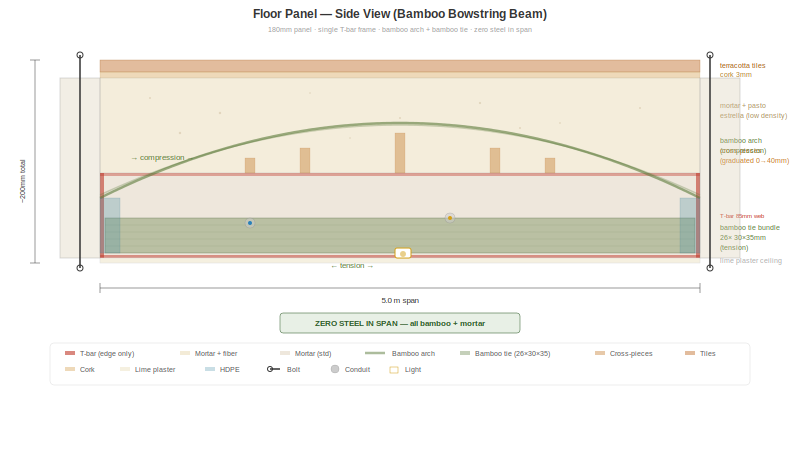
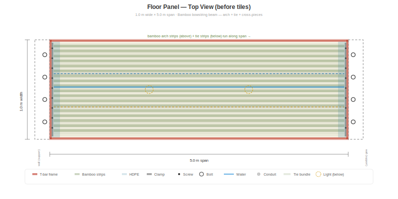

# Floor Panel Concept — Bamboo Bowstring Beam

> **Status: Concept under refinement — not tested.** This document describes a proposed extension of the BaharequeModular panel system for horizontal floor/ceiling spans. All structural estimates are analytical and require lab validation. Contributions, critique, and testing offers are welcome.

## The Goal

Extend BaharequeModular from a wall system to a **complete building system** — walls, floors, and ceilings from the same production line, same materials, same skills. No concrete slab. No steel beams. No rebar.

## The Problem

A standard 85 mm wall panel fails when laid horizontally to span 4–5 m as a floor. The mortar cracks in tension on the bottom face — the panel was designed for compression (walls), not bending (floors).

## The Solution: Bamboo Bowstring Beam

A single T-bar frame (the same part used in wall panels) with a **tied-arch** mechanism inside:

- **Bamboo compression arch** — strips forced into a parabolic curve by graduated perpendicular cross-pieces sitting on top of the T-bar web
- **Bamboo tension tie** — 26 strips (30 × 35 mm) screw-clamped in a single layer across the bottom T-bar flange
- **Mortar** fills and stabilizes everything
- **Zero steel in the span** — steel only at the perimeter T-bar frame for connections



Each material does what it does best:

| Material | Role | Strength used |
|----------|------|--------------|
| Bamboo arch | Compression | 45 MPa (only 20–31% utilized) |
| Bamboo tie | Tension | 25 MPa at 30% utilization |
| Bamboo cross-pieces | Geometry control | Forces arch into parabolic shape |
| Mortar | Fill + stability | Compression zone above arch |
| T-bar frame | Edge connection | Shear at supports, connection to walls |



## How It Works

A bowstring beam (tied arch) converts the vertical floor load into horizontal thrust. The arch carries this thrust in compression. The tie resists it in tension. The two are in equilibrium — the mortar fills between them, providing stability and distributing local loads.

```
     load (people, furniture)
     ↓ ↓ ↓ ↓ ↓ ↓ ↓ ↓ ↓ ↓ ↓
┌───────────────────────────────┐
│  mortar (compression fill)    │
│   ╭───── bamboo ARCH ─────╮  │ ← compression
│   │    forced up by         │ │
│   │    cross-pieces         │ │
│   ╰─────────────────────────╯ │
│  ════ bamboo TIE ════════════ │ ← tension
└───────────────────────────────┘
     ↑                       ↑
   wall                    wall
```

The arch rise (distance from tie to arch crown) determines how much thrust is generated. A taller arch = less thrust = fewer tie strips needed.

## Specifications (180 mm panel, recommended)

| Property | Value |
|----------|-------|
| Panel dimensions | 1.0 m wide × 4.0 or 5.0 m span |
| Total depth | 180 mm |
| T-bar frame | Standard 30×30×3 mm, 85 mm web — single frame at bottom |
| Bamboo arch | 27 strips × 20×20 mm × 2 layers, forced into parabola |
| Cross-pieces | 30×30 mm perpendicular bamboo, graduated 0→40 mm |
| Bamboo tie | 26 strips × 30×35 mm, single layer, screw-clamped |
| Arch rise | 127 mm (tie to crown) |
| Weight | ~325 kg/m² |

## Structural Performance

| Span | Thrust | Arch ratio | Tie ratio | Deflection | Status |
|------|--------|-----------|-----------|------------|--------|
| 4.0 m | 121 kN | 0.31 (69% reserve) | 0.92 (8% reserve) | 2.2 mm / 13.3 limit | OK |
| 5.0 m | 189 kN | 0.49 (51% reserve) | 0.98 (2% reserve) | 5.0 mm / 16.7 limit | OK |

Floor load: 4.5 kN/m² (dead 2.5 + live 2.0, per NSR-10 residential). Self-weight included.

## Integrated Services

Services are embedded during the pour — same approach as wall panels:

- **Electrical conduit** (12V + 120V) in the core — ceiling lights below, floor outlets above
- **Water pipes** (CPVC/PEX) horizontal runs in the core
- **Recessed LED lights** — junction boxes flush with bottom T-bar flange
- **Snap-connect** at panel edges — circuits continue from wall to floor to wall

## Acoustic Performance

The mortar mass provides STC 52–55 (airborne sound). Impact noise (footsteps) is addressed by:

- **Pasto estrella fiber** (3–5% by volume) in the upper mortar zone — free invasive grass, millions of fiber-mortar interfaces absorb vibration
- **Cork underlay** (3 mm) under terracotta tiles — $4/m², adds IIC +15–20
- Combined: IIC 58–63 (luxury hotel level) at minimal cost

## Construction Process

Poured in place on top of wall panels:

1. Set T-bar frame on wall tops (~25 kg — easy to carry)
2. Insert overlength bolts (M12 × 110 mm) through wall and frame
3. Clamp soffit panel from below with bottom nut + EPDM gasket
4. Screw-clamp bamboo tie strips to bottom flange
5. Place graduated cross-pieces on top of web
6. Lay bamboo arch strips over cross-pieces, wire-tie at crossings
7. Install conduit, pipes, junction boxes
8. Pour mortar — standard mix for lower zone, fiber-rich for upper zone
9. Vibrator probe along the span — eliminates voids
10. Screed top surface flat
11. Cure 7+ days
12. Unscrew bottom nuts, remove soffit → reuse for next bay
13. Lime plaster ceiling from below
14. Cork + terracotta tiles on top

## What's Novel

Exhaustive search of academic literature, patents, and built projects found **no existing system** that combines:

1. Bamboo compression arch within a floor element
2. Bamboo tension tie at the bottom
3. Tied-arch (bowstring) mechanism
4. Mortar encasement

Each principle is well-established individually. The combination is new. Closest prior art:

| Existing work | What's different |
|---------------|-----------------|
| Curved laminated bamboo-concrete T-beam (2023) | No tension tie, glulam not strips |
| Bamboo-reinforced concrete (Ghavami, 1979+) | Always straight reinforcement, never arched |
| Bowstring trusses (steel/timber) | Never bamboo, never mortar-encased |
| Ferrocement bamboo panels (India) | Flat, short spans, no arch |

## What Needs Testing

Before building floor panels, the following must be validated:

1. **Does the tied-arch action develop?** — Load a test panel, measure horizontal thrust at supports
2. **Does the forced arc hold under load?** — Do cross-pieces maintain the arch geometry?
3. **Bamboo tie tension** — Does the 30×35 mm clamped bundle maintain capacity under arch thrust?
4. **Composite action** — Does the mortar-bamboo bond hold in the arch under compression?
5. **Impact sound** — Measure IIC with and without pasto estrella fiber
6. **Connection** — Test the overlength bolt system (wall-floor-wall triple flange)

A single bending test (simply supported, uniform load) answers questions 1–4 in one afternoon.

## Future Option: Half-Culm Voided Panel

For spans beyond 5 m, split guadua culms (⌀100 mm, open cavity down, drilled air holes) can be embedded in the compression zone above the arch. The hollow cores displace mortar, and the culm walls contribute compression capacity. This increases depth (220+ mm) without proportional weight increase. See detailed analysis in the Jardín project documentation.

## Implications

If validated, this floor panel makes BaharequeModular a **complete building system**:

- **Walls** — standard 85 mm panel
- **Floors/ceilings** — 180 mm bowstring panel
- **Connections** — bolted T-bar flanges at every junction
- **Electrical** — integrated in all panels, snap-connected
- **Plumbing** — integrated in floor and wall panels
- **Ceiling finish** — lime plaster on floor panel bottom

One panel system. One production line. One set of skills. Zero steel spanning any distance — bamboo and mortar carry everything. Steel only at the edges for connections.

**A bamboo bowstring beam cast in mortar. It doesn't exist yet. We intend to build and test it.**
