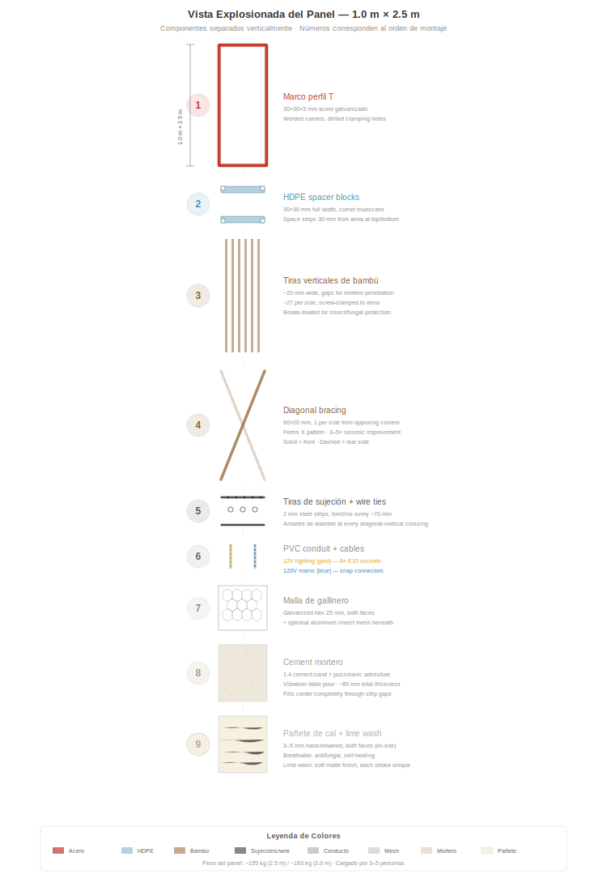
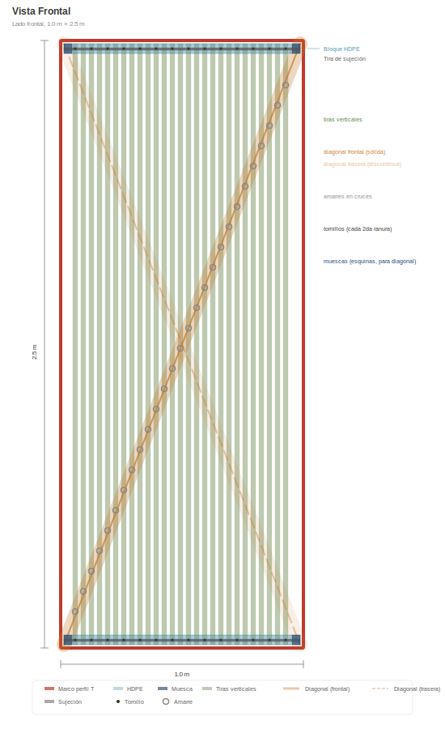
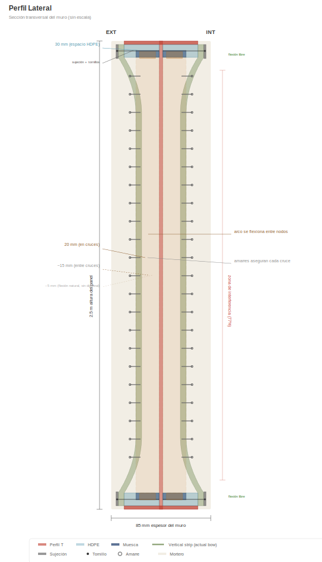
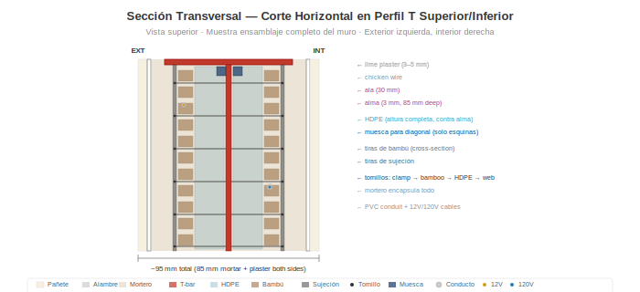

# Anatomía del Panel

> **Actualización de SVG pendiente:** algunos diagramas en este capítulo están pasando de la especificación anterior de perfil T a la especificación actual de **ángulo L 40×40×4 mm**. Algunos SVG específicos del perfil T fueron temporalmente eliminados hasta su regeneración. Ver [`SVG-STATUS.md`](../SVG-STATUS.md) en la raíz del repositorio para la lista completa de regeneración de SVG.

## Resumen

Cada panel de muro es de **1,0 m de ancho × 2,5 m de alto** (orientación vertical). El peso del panel depende de la fase de producción: un **montaje en seco** (marco + bambú + malla + instalaciones, antes del vertido del mortero) pesa aproximadamente **~75 kg** y es la forma que se entrega del taller a la obra para verter el mortero in situ. Una vez vertido el mortero, curado y aplicados los acabados in situ (pañete, lechada de cal):

- **Peso base del muro terminado:** aproximadamente **~440 kg** por panel (≈ 176 kg/m²) con la mezcla estándar documentada (30 % de contenido de guadua en la cavidad + mortero de cemento-arena + 10 mm de pañete de cal en ambas caras).
- **Mezcla bahareque optimizada:** aproximadamente **~360 kg** por panel (≈ 144 kg/m²) con mortero de cal puzolánica con fibras de pasto estrella + 30 % de guadua + 5 mm de pañete de cal en ambas caras. Práctica tradicional de bahareque colombiano transferida al sistema modular; carbono incorporado ligeramente menor, costo algo menor, desempeño estructural pleno.

Cada panel contiene estructura, aislamiento e instalación eléctrica integrados. Un solo tamaño. Cuatro variantes.

> **Escalabilidad:** La altura de 2,5 m se adapta a alturas de techo residenciales estándar en todo el mundo. El sistema se escala a cualquier altura — 3,0 m para techos altos, 2,7 m para espacios comerciales, 2,0 m para divisiones. Solo cambian la longitud de los ángulos L verticales y las tiras de bambú. La plantilla del marco, el sistema de sujeción, el proceso de mortero y la distribución eléctrica permanecen idénticos.

## Marco: Ángulo L 40×40×4 mm

> _Diagrama del perfil del marco pendiente — la regeneración del SVG para L 40×40×4 aún no está disponible. Ver `SVG-STATUS.md`._

El marco del panel es un ángulo L comercial (perfil angular de alas iguales laminado en caliente, ASTM A36 / equivalente ICONTEC, galvanizado en caliente):

- **Perfil:** L 40×40×4 mm (ambas alas de 40 mm de ancho, 4 mm de espesor)
- **Un ala (patín):** 40 mm × 4 mm — mira hacia afuera, a ras con la superficie de mortero
- **Otra ala (alma):** 40 mm × 4 mm — se proyecta hacia adentro, proporciona profundidad estructural y superficie de sujeción para tiras de bambú y malla
- **Espesor del muro:** ~85 mm (el alma del ángulo L queda en el núcleo de mortero, el mortero llena ~41 mm a cada lado del plano del alma)
- **Esquinas:** Cortadas a inglete a 45° y soldadas en una plantilla — todos los marcos son idénticos. Cartelas de esquina opcionales para rigidez adicional
- **Agujeros de sujeción:** Perforados cada ~70 mm a lo largo de las almas superior e inferior (un agujero por cada dos tiras de bambú). Tiras de sujeción de bambú (platina 40×3) se atornillan en estos agujeros
- **Disponibilidad:** Producto comercial, disponible mundialmente en cualquier proveedor importante de acero. En Colombia: Gerdau Diaco, Aceros Arequipa, Acesco, Ferrasa, Colmena/Sidenal. Stock en barras de 6 m, corte a medida con tronzadora. Sin fabricación a medida, sin almas asimétricas
- **¿Por qué ángulo L y no perfil T?:** Estructuralmente equivalente para el marco permanentemente embebido en mortero (ver [Desempeño Estructural](05-desempeno-estructural.md)), peso de acero significativamente menor (~22 kg/panel frente a ~45 kg con T 60×60×7), menor costo, menor CO₂ incorporado y — crítico — disponible como stock comercial en lugar de fabricación asimétrica a medida

El marco es la columna vertebral estructural. Todo lo demás se fija a él.

## Separadores de HDPE

- **Tamaño:** Sección transversal de 30 × 30 mm, ancho completo de 1 m
- **Posición:** Montados sobre las almas del ángulo L superior e inferior (2 por panel)
- **Función:** Separan las tiras de bambú 30 mm del alma en los bordes superior e inferior
- **Muescas en esquinas:** Cortes de 10 × 10 mm en cada esquina anclan las tiras diagonales a nivel del alma
- **Material:** HDPE reciclado (de lámina o tubería). Cero pudrición, cero corrosión, dimensionalmente estable

## Tiras Verticales de Guadua

- **Material:** Guadua angustifolia tratada con borato, partida en tiras
- **Dimensiones:** ~20 mm de ancho × 2.500 mm de largo
- **Separación:** ~20 mm de espacio entre tiras (penetración del mortero)
- **Cantidad:** ~27 tiras por lado, ~54 en total por panel
- **Fijación:** Sujetas con tornillos al alma del ángulo L superior e inferior mediante tiras de sujeción

### El Perfil )(

En la parte superior e inferior, los bloques de HDPE mantienen las tiras a 30 mm del alma. A media altura, las tiras se flexionan naturalmente hacia adentro, acercándose al alma — creando un perfil de sección transversal **)(**. Esto no es un defecto; es el diseño:

- El mortero llena el espacio variable, creando una forma de arco natural
- El arco resiste fuerzas fuera de plano (viento, impacto)
- El mortero de espesor variable traba las tiras mecánicamente

## Tiras Diagonales de Bambú

- **Dimensiones:** 60 × 20 mm, ~2.690 mm de largo (diagonal de esquina a esquina)
- **Cantidad:** 1 por lado, desde esquinas opuestas (forman una X visto de frente)
- **Posición:** Va a nivel del alma, pasando por las muescas de esquina de los bloques de HDPE
- **Pre-tensionadas:** Se jalan tensas antes de asegurar
- **Función:** Convierte las fuerzas sísmicas de corte en tracción en la diagonal. Proporciona una **mejora de 3–5× en resistencia al volcamiento** sobre paneles sin diagonales.

### Amarres de Alambre

Amarres de alambre galvanizado en cada cruce diagonal-vertical (~8–10 por lado). Estos traban las tiras verticales y diagonales en una cuadrícula rígida, distribuyendo las cargas puntuales a lo largo de toda la cara del panel y creando un modo de falla dúctil.

## Conducto de PVC

- **Tamaño:** Conducto eléctrico estándar de 16 mm
- **Posición:** Entre las tiras de bambú, contra el alma
- **Función:** Protege los cables de 12V y 120V del mortero y la presión de los tornillos. Permite reemplazar cables jalando cable nuevo sin abrir el panel.

## Sistemas Eléctricos

Cada panel contiene dos circuitos independientes:

### Iluminación 12V
- Cable de 2 conductores en conducto de PVC
- 6× portalámparas de rosca E10 (3 por lado) cerca de la parte superior del panel
- Bombillos incandescentes o LED de luz cálida (0,5–1W cada uno) — iluminación de baño de luz
- Conectores rápidos de 2 pines en ambos bordes verticales

### Red 120V (según variante)
- Cable de 3 conductores (L + N + T) en conducto de PVC
- Conectores rápidos de 3 pines en ambos bordes verticales
- Cuando los paneles se empernan adyacentes, los conectores hacen clic = circuito continuo

## Variantes de Panel

| Tipo | Proporción | Contenido |
|------|------------|----------|
| **P** — Paso | ~60% | Iluminación 12V + cable de paso 120V. Sin tomacorrientes. |
| **O** — Tomacorriente | ~18% | Iluminación 12V + tomacorriente doble a ~40 cm de altura |
| **S** — Interruptor + Tomacorriente | ~9% | Iluminación 12V + interruptor a ~120 cm + tomacorriente a ~40 cm |
| **W** — Agua + Tomacorriente | ~13% | Iluminación 12V + tomacorriente + acometidas de agua fría/caliente + desagüe de aguas grises |

Todas las variantes comparten el mismo marco, el mismo relleno de bambú, el mismo mortero. Solo difieren los servicios integrados.

## Mortero

- **Mezcla:** 1:4 cemento Portland : arena de río limpia
- **Aditivos:** Fibra de polipropileno (6–12 mm) para prevención de grietas durante el curado + adición puzolánica (ceniza volcánica, ceniza de cascarilla de arroz o metacaolín)
- **Aplicación:** Vertido en mesa vibradora (ver [Proceso Constructivo](04-proceso-constructivo.md))
- **Espesor total del muro:** ~85 mm (mortero + guadua + mortero)
- **La puzolana** reduce el pH del mortero con el tiempo, retardando la degradación del bambú embebido

## Capas de Acabado (aplicadas en obra después de la instalación)

1. **Malla de gallinero** — malla hexagonal galvanizada (abertura de 25 mm), grapada en ambas caras. Proporciona traba mecánica para la adherencia del mortero/pañete.
2. **Malla fina de aluminio** (opcional) — malla estándar contra insectos/polvo, abertura de 1–1,5 mm. Bloquea insectos, polvo fino y polen que puedan entrar por la matriz de mortero. Como propiedad secundaria, la capa de aluminio también proporciona atenuación medible de radiofrecuencia.
3. **Pañete de cal** — 3–5 mm, aplicado a llana. Transpirable, antifúngico, autoreparable. Opcional: fibra de pasto seco picado para resistencia a grietas.
4. **Lechada de cal** — cal + agua, aplicada con brocha. Acabado mate suave. Cada pincelada es única.

## Desglose de Peso (aproximado)

| Componente | Peso |
|------------|------|
| Marco de acero | ~18 kg |
| Bloques de HDPE | ~1 kg |
| Tiras de bambú + diagonales | ~12 kg |
| Mortero (85 mm × 1 m × 2,5 m) | ~120 kg |
| Alambre, malla, conducto, cables | ~6 kg |
| **Total** | **~155 kg** |

Transportable por 3–4 personas con una plantilla de carga sencilla.
