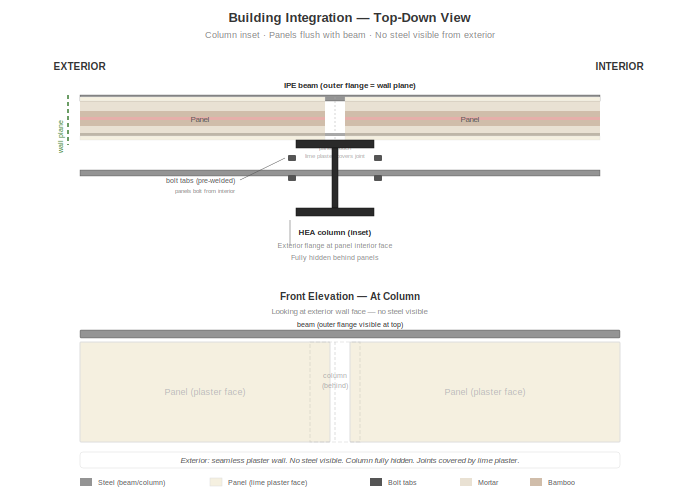

# Integración al Edificio



## Dos Configuraciones

El sistema de paneles fue diseñado para funcionar **con un marco de acero** pero es estructuralmente capaz de sostenerse por sí solo. Cada panel puede soportar ~4.000 kg verticalmente — más que suficiente para un segundo piso y techo sin columnas de acero.

| Configuración | Mejor para | Rol estructural de los paneles |
|---------------|-----------|-------------------------------|
| **Con marco de acero** | Varios pisos, zonas de alta sismicidad, comercial | Relleno — el acero soporta las cargas principales, los paneles agregan arriostramiento |
| **Sin marco de acero** | Un piso + altillo, sismicidad moderada, residencial | Portante — los paneles soportan el techo y piso superior directamente, conectados por viga de coronación |

Las secciones siguientes describen la configuración con marco de acero en detalle. Para la configuración sin marco, reemplace las columnas de acero por una viga de coronación de madera/bambú en la parte superior del muro, y emperne los paneles a una solera de concreto en la base y entre sí en los bordes.

## Configuración con Marco de Acero

### Requisitos del Marco

| Elemento | Especificación |
|----------|---------------|
| Columnas | HEA 150 o equivalente (dimensionadas según cálculo de ingeniería) |
| Vigas | IPE 160–200 (salvando la luz entre columnas) |
| Conexiones | Empernadas en obra; placas de pernos pre-soldadas en taller |
| Separación de columnas | 2–4 m (incrementos de 1 m = número exacto de paneles por vano) |
| Cimentación | Concreto reforzado según norma sísmica local |

### Relación Columna-Panel

El detalle de diseño clave: **las columnas están retranqueadas por el espesor del panel** respecto a las vigas.

- La cara exterior del ala de la viga = el plano del muro
- Los paneles quedan a ras con la cara de la viga
- La columna queda detrás de los paneles, completamente oculta
- Desde afuera: muro continuo de pañete sin acero visible

Esto se logra soldando **pestañas de perno** en las alas de la columna a la altura del panel. Los paneles se empernan a estas pestañas desde el lado interior.

## Secuencia de Instalación de Paneles

1. **Marco de acero erigido** — columnas, vigas, estructura de techo completa
2. **Empezar desde una esquina** — empernar primer panel a la pestaña de la columna
3. **Panel adyacente** — empernar a la siguiente pestaña, empujar borde contra el primer panel (mortero contra mortero)
4. **Conectar electricidad** — los conectores rápidos de 12V y 120V hacen clic en la junta del panel
5. **Continuar alrededor de la edificación** — los paneles llenan cada vano entre columnas
6. **Aberturas de ventanas/puertas** — omitir paneles, enmarcar la abertura con dinteles de acero
7. **Probar todos los circuitos** — antes del acabado
8. **Pañete de cal** — cubrir todas las caras de los paneles y juntas sin costuras
9. **Lechada de cal** — acabado final

## Detalle Panel-Columna (Vista en Planta)

```
EXTERIOR                              INTERIOR

|← Pañete de cal (3-5mm)
|← Mortero (15mm)
|← Malla de gallinero
|← Tiras de bambú
|← Alma del perfil T  ┌─────────┐
|← Relleno de mortero  │ COLUMNA │  ← HEA 150
|← Tiras de bambú      │ (oculta)│    (retranqueada)
|← Malla de gallinero  │         │
|← Mortero (15mm)      └─────────┘
|← Pañete de cal

Cara exterior del panel = Cara exterior de la viga = Plano del muro
```

## Junta Panel-Panel

Los paneles adyacentes se tocan **cara de mortero contra cara de mortero**. La junta se:

1. Rellena con mortero (si existe alguna separación)
2. Cubre con franja de malla de gallinero (puenteando la junta)
3. Pañeta con cal por encima — completamente invisible en el muro terminado

Los conectores eléctricos rápidos están en la línea de junta. Cuando los paneles se juntan, los conectores de 2 pines (12V) y 3 pines (120V) se acoplan automáticamente.

## Aberturas de Ventanas y Puertas

- Omitir paneles donde se necesiten aberturas
- Enmarcar la abertura con dinteles de acero (soldados a las columnas/vigas de la edificación)
- Los bordes de los paneles en las aberturas quedan expuestos (borde del marco de acero visible) — se cubren con moldura de teca, madera u acero
- Práctica estándar: aberturas en anchos de panel enteros (1 m, 2 m, 3 m) para bordes limpios

## Muros Divisorios Interiores

Mismos paneles, instalados entre columnas interiores o soportes piso-a-techo:

- Ambos lados visibles y acabados con pañete de cal
- Separación acústica y contra incendios completa
- Circuitos eléctricos independientes de los circuitos del muro exterior
- Se pueden remover y reconfigurar (los paneles se desempernan del marco)

## Conexión al Techo

- Los paneles llegan hasta el nivel de la viga (parte superior del muro)
- La estructura del techo (correas, alfardas) se apoya sobre la viga
- El espacio entre la parte superior del panel y la parte inferior del techo se sella con mortero o moldura
- El alero del techo protege el muro de la lluvia — mínimo 1,5 m recomendado en climas tropicales

## Conexión al Piso

- Los paneles se apoyan sobre la losa del piso o viga del primer nivel
- La base del panel está 30–50 mm por encima del nivel de piso terminado (protección contra la humedad)
- Una placa base de acero galvanizado o solera de madera dura salva el espacio
- Sellada con mortero y pañete de cal

## Integración del Sistema Eléctrico

Cuando los paneles se instalan secuencialmente, los conectores rápidos crean circuitos continuos:

- **Iluminación 12V:** Recorre todos los paneles. Conectada a un transformador/fuente 12V central. Las luces individuales de cada panel se pueden controlar con interruptores en los paneles Tipo S.
- **Red 120V:** Recorre todos los paneles. Conectada al tablero principal de la edificación. Breakers dimensionados según el código eléctrico local.
- **Agua (paneles Tipo W):** Las acometidas se conectan a los colectores de plomería de la edificación a nivel de piso. Las terminaciones se destapan y se conectan a los aparatos después de la instalación.

## Adaptabilidad

El sistema de paneles se acomoda a diferentes configuraciones de edificaciones:

| Configuración | Notas |
|---------------|-------|
| Un piso | Instalación estándar |
| Dos pisos | Paneles del piso superior idénticos, empernados al marco de vigas del nivel superior |
| Plantas en L o U | Paneles de esquina: unión a 90° con columna de acero en esquina |
| Muros curvos | No soportado (los paneles son planos). Usar aproximación facetada con columnas anguladas. |
| Construcción mixta | Los paneles pueden llenar parte de una edificación, con otros materiales (vidrio, piedra, madera) en otras áreas |
