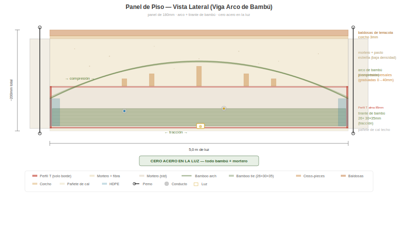
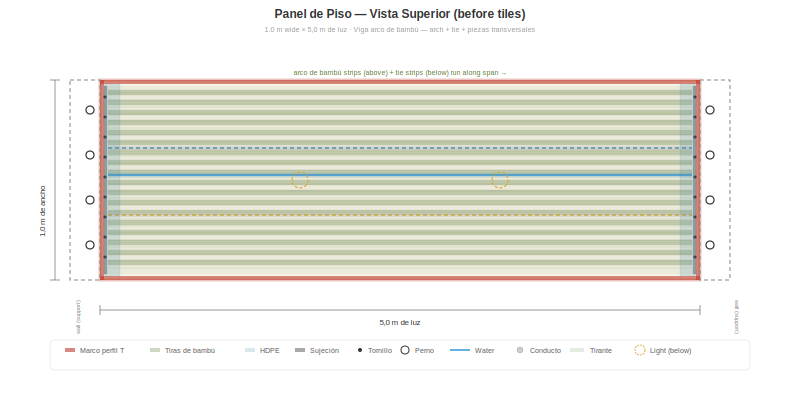

# Concepto de Panel de Piso — Viga Arco de Bambú

> **Estado: Concepto en desarrollo — no probado.** Este documento describe una propuesta de extensión del sistema BaharequeModular para luces horizontales de piso/techo. Todas las estimaciones estructurales son analíticas y requieren validación en laboratorio. Contribuciones, críticas y ofertas de ensayos son bienvenidas.

## El Objetivo

Extender BaharequeModular de un sistema de muros a un **sistema constructivo completo** — muros, pisos y techos desde la misma línea de producción, mismos materiales, mismas habilidades. Sin losa de concreto. Sin vigas de acero. Sin refuerzo de acero.

## El Problema

Un panel de muro estándar de 85 mm falla cuando se coloca horizontalmente para cubrir luces de 4–5 m como piso. El mortero se fisura en tracción en la cara inferior — el panel fue diseñado para compresión (muros), no para flexión (pisos).

## La Solución: Viga Arco de Bambú (Bowstring Beam)

Un solo marco de perfil T (la misma pieza usada en paneles de muro) con un mecanismo de **arco atirantado** interior:

- **Arco de bambú en compresión** — tiras forzadas en una curva parabólica por piezas transversales perpendiculares graduadas sobre el alma del perfil T
- **Tirante de bambú en tracción** — 26 tiras (30 × 35 mm) sujetadas con tornillos en una sola capa en el ala inferior del perfil T
- **Mortero** rellena y estabiliza todo
- **Cero acero en la luz** — acero solo en el marco perimetral del perfil T para conexiones



Cada material hace lo que mejor sabe hacer:

| Material | Función | Resistencia utilizada |
|----------|---------|----------------------|
| Arco de bambú | Compresión | 45 MPa (solo 20–31% utilizado) |
| Tirante de bambú | Tracción | 25 MPa al 30% de utilización |
| Piezas transversales | Control geométrico | Fuerzan el arco en forma parabólica |
| Mortero | Relleno + estabilidad | Zona de compresión sobre el arco |
| Marco de perfil T | Conexión perimetral | Corte en apoyos, conexión a muros |



## Cómo Funciona

Una viga arco (arco atirantado) convierte la carga vertical del piso en empuje horizontal. El arco lleva este empuje en compresión. El tirante lo resiste en tracción. Los dos están en equilibrio — el mortero rellena entre ellos, proporcionando estabilidad y distribuyendo cargas locales.

## Especificaciones (panel de 180 mm, recomendado)

| Propiedad | Valor |
|-----------|-------|
| Dimensiones del panel | 1,0 m ancho × 4,0 o 5,0 m de luz |
| Profundidad total | 180 mm |
| Marco de perfil T | Estándar 30×30×3 mm, alma de 85 mm — un solo marco en la parte inferior |
| Arco de bambú | 27 tiras × 20×20 mm × 2 capas, forzado en parábola |
| Piezas transversales | Bambú de 30×30 mm, graduadas de 0→40 mm |
| Tirante de bambú | 26 tiras × 30×35 mm, una sola capa, sujetadas con tornillos |
| Flecha del arco | 127 mm (tirante a corona) |
| Peso | ~325 kg/m² |

## Rendimiento Estructural

| Luz | Empuje | Ratio arco | Ratio tirante | Deflexión | Estado |
|-----|--------|-----------|---------------|-----------|--------|
| 4,0 m | 121 kN | 0,31 (69% reserva) | 0,92 (8% reserva) | 2,2 mm / 13,3 límite | OK |
| 5,0 m | 189 kN | 0,49 (51% reserva) | 0,98 (2% reserva) | 5,0 mm / 16,7 límite | OK |

Carga de piso: 4,5 kN/m² (muerta 2,5 + viva 2,0, según NSR-10 residencial). Peso propio incluido.

## Detalle Crítico: Sujeción de las Tiras del Tirante

El tirante de bambú lleva todo el empuje horizontal del arco — 121 kN (luz de 4 m) o 189 kN (luz de 5 m), repartido entre 26 tiras. Por tira:

| Luz | Tracción por tira | Con factor de seguridad 2,0 |
|-----|-------------------|----------------------------|
| 4,0 m | 4.654 N | 9.308 N |
| 5,0 m | 7.269 N | 14.538 N |

Si la sujeción falla, todo el mecanismo de arco atirantado falla. Esta es la conexión más crítica del panel.

### El Problema con Sujeción Lisa

Cada tira del tirante cruza el perfil T transversal en cada apoyo. El ala del perfil T tiene solo 30 mm de ancho — proporcionando 30 mm de longitud de sujeción por extremo. Con fricción lisa acero-bambú (μ ≈ 0,4), la capacidad de extracción es marginal a 4 m e insuficiente a 5 m.

### Solución: Tira de Sujeción con Perfil en V

Una tira de sujeción de acero con un **perfil dentado en V** estampado (dientes hacia el bambú) convierte la conexión de fricción a interbloqueo mecánico:

```
    tornillo  tornillo  tornillo
       ↓         ↓         ↓
      ╔═╗       ╔═╗       ╔═╗
──────╝ ╚───────╝ ╚───────╝ ╚──  Tira con perfil V (dientes abajo)
═════════╤════════╤════════╤════  Tiras de bambú del tirante
─────────┴────────┴────────┴────  Ala del perfil T (lisa)
```

El bambú se apoya sobre el ala lisa del perfil T. La tira en V presiona desde arriba, con los dientes indentando ~1,5–2 mm en la superficie del bambú. Para extraerse, el bambú debe cortar por cizallamiento cada indentación — no solo superar la fricción.

### Especificación de la Tira de Sujeción

| Propiedad | Valor |
|-----------|-------|
| Material | Pletina de acero galvanizado de 3 mm |
| Ancho | 100 mm |
| Paso de dientes en V | 6 mm |
| Profundidad de dientes | 2 mm |
| Longitud | 1.000 mm (ancho completo del panel — una tira sujeta las 26 tiras del tirante) |
| Tornillos | M5, cada 2 tiras (13 tornillos por extremo) |
| Cantidad | 2 por panel (uno por apoyo) |
| Costo | ~$3/panel |
| Fabricación | Estampar o prensar perfil V en pletina con troquel dentado |

### Estimación de Capacidad

Cada diente en V crea un labio de cizallamiento en el bambú:

- Área de corte por diente: 30 mm (ancho de tira) × 1,5 mm (profundidad) = 45 mm²
- Resistencia al corte del bambú paralelo a la fibra: ~7 MPa
- Resistencia por diente: 315 N
- Dientes por tira (100 mm a paso de 6 mm): ~16 dientes
- Interbloqueo mecánico por extremo: 16 × 315 = **5.040 N**
- Más fricción en cara inferior: ~3.072 N
- **Total por extremo: ~8.112 N → ambos extremos: ~16.224 N**

| Luz | Requerido (FS=2,0) | Capacidad perfil V | Reserva |
|-----|--------------------|--------------------|---------|
| 4,0 m | 9.308 N | 16.224 N | 74% |
| 5,0 m | 14.538 N | 16.224 N | 12% |

Estas estimaciones son conservadoras — ignoran la adherencia del mortero que encapsula toda la zona de sujeción después del vertido.

### Prioridad de Ensayo

Un ensayo de extracción de una sola tira sujetada es la validación más simple y crítica: sujetar una tira de bambú de 30 × 35 mm con el perfil V, tirar hasta la falla, medir la fuerza máxima. Esto se puede hacer con un gato hidráulico y una balanza en minutos.

## Lo Que es Nuevo

Búsqueda exhaustiva de literatura académica, patentes y proyectos construidos no encontró **ningún sistema existente** que combine:

1. Arco de bambú en compresión dentro de un elemento de piso
2. Tirante de bambú en tracción en la parte inferior
3. Mecanismo de arco atirantado (bowstring)
4. Encapsulamiento en mortero

Cada principio está bien establecido individualmente. La combinación es nueva. Coincidencias más cercanas:

| Trabajo existente | Qué falta |
|-------------------|-----------|
| Viga T de bambú laminado curvo-concreto (2023) | Sin tirante de tracción, bambú laminado no tiras |
| Concreto reforzado con bambú (Ghavami, 1979+) | Siempre refuerzo recto, nunca en arco |
| Cerchas bowstring (acero/madera) | Nunca en bambú, nunca encapsuladas en mortero |
| Paneles de ferrocemento con bambú (India) | Planos, luces cortas, sin arco |

## Lo Que Necesita Pruebas

1. **¿Se desarrolla la acción de arco atirantado?** — Cargar un panel de prueba, medir el empuje horizontal en los apoyos
2. **¿Se mantiene el arco forzado bajo carga?** — ¿Las piezas transversales mantienen la geometría del arco?
3. **Tracción del tirante de bambú** — ¿El paquete de 30×35 mm sujetado mantiene su capacidad bajo el empuje del arco?
4. **Acción compuesta** — ¿Se mantiene la adherencia mortero-bambú en el arco bajo compresión?
5. **Sonido de impacto** — Medir IIC con y sin fibra de pasto estrella
6. **Conexión** — Probar el sistema de pernos de longitud extra (unión muro-piso-muro con triple ala)

Un solo ensayo de flexión (simplemente apoyado, carga uniforme) responde las preguntas 1–4 en una tarde.

## Optimización de Peso: Zonas de Extremo con Bambú Denso

En una viga arco atirantado, la flecha del arco es cercana a cero en los apoyos — el mortero sobre el arco tiene máxima profundidad pero no lleva compresión. El cortante es máximo en los apoyos, pero con solo 5% de utilización (0,075 MPa vs 1,5 MPa de capacidad). Esto significa que las zonas de extremo contienen más mortero haciendo menos trabajo estructural.

**La idea:** reemplazar la mayor parte del mortero en las zonas de extremo con tiras de bambú densamente empacadas.

### Geometría

Zona de extremo: primeros y últimos 750 mm de la luz. La profundidad de mortero sobre el arco varía de ~140 mm en el apoyo a ~80 mm a 750 mm.

### Fabricación

1. Empaquetar tiras de bambú (20 × 30 mm) apretadamente, amarradas con alambre en un bloque sólido
2. Cortar el bloque ~10 mm más ancho que la cavidad del panel (~1.010 mm)
3. Insertar a presión en la zona de extremo sobre el arco — la elasticidad natural del bambú lo acuña firmemente contra el alma del perfil T y los bordes del panel, auto-sujetándose sin fijaciones
4. Durante el vertido de mortero, este penetra los pequeños espacios irregulares entre tiras, bloqueando todo permanentemente

Con tiras rectangulares empacadas apretadamente, la irregularidad natural de la superficie del bambú rajado produce aproximadamente 60% bambú / 40% mortero por volumen.

### Ahorro de Peso

| | Mortero sólido (actual) | Empaque denso de bambú |
|---|---|---|
| Bambú | — | 0,099 m³ × 700 kg/m³ = 69 kg |
| Mortero | 0,165 m³ × 2.100 kg/m³ = 347 kg | 0,066 m³ × 2.100 kg/m³ = 139 kg |
| **Total (ambos extremos)** | **347 kg** | **208 kg** |
| **Ahorro** | — | **~139 kg (11% del peso del panel)** |

### Por Qué Funciona

- **Transferencia de cortante:** el bambú tiene buena resistencia al cortante (~8 MPa) — el empaque denso con mortero en los intersticios transfiere el cortante del apoyo mejor que el mortero sin refuerzo
- **Capacidad de aplastamiento:** el bambú sobresale en compresión (45 MPa) — directamente sobre el apoyo, esto es una ventaja
- **Sin momento flector** en los apoyos — las zonas de extremo no necesitan la masa del mortero para profundidad estructural
- **Fabricación simple:** bloques pre-ensamblados se pueden cortar al ancho e insertar a presión, agregando un paso fácil al proceso constructivo

## Implicaciones

Si se valida, este panel de piso convierte a BaharequeModular en un **sistema constructivo completo**:

- **Muros** — panel estándar de 85 mm
- **Pisos/techos** — panel bowstring de 180 mm
- **Conexiones** — alas de perfil T empernadas en cada unión
- **Electricidad** — integrada en todos los paneles
- **Plomería** — integrada en paneles de piso y muro
- **Acabado de techo** — pañete de cal en la cara inferior del panel de piso

Un sistema de paneles. Una línea de producción. Un conjunto de habilidades. Cero acero en cualquier luz — bambú y mortero llevan todo. Acero solo en los bordes para conexiones.

**Una viga arco de bambú fundida en mortero. Aún no existe. Queremos construirla y probarla.**
