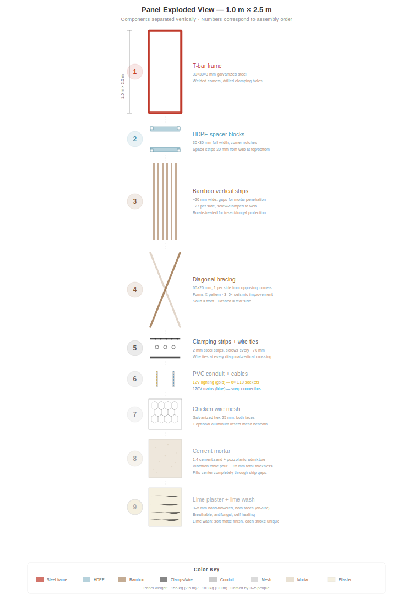
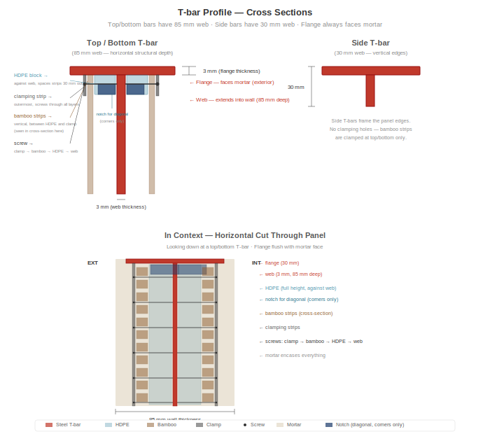
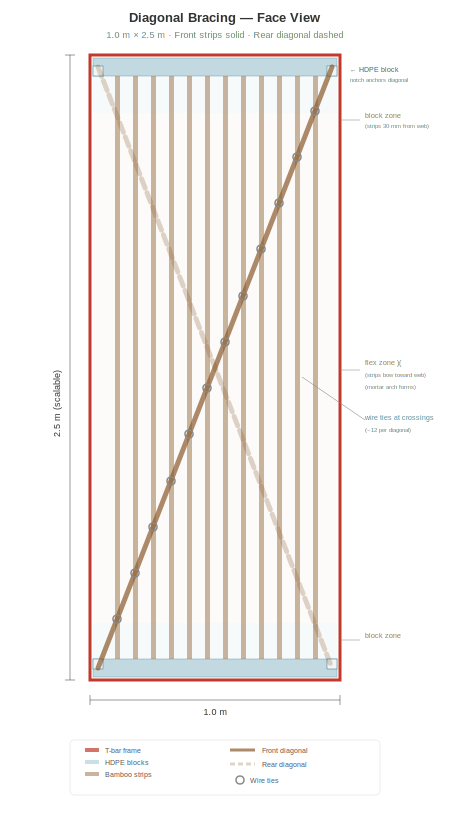
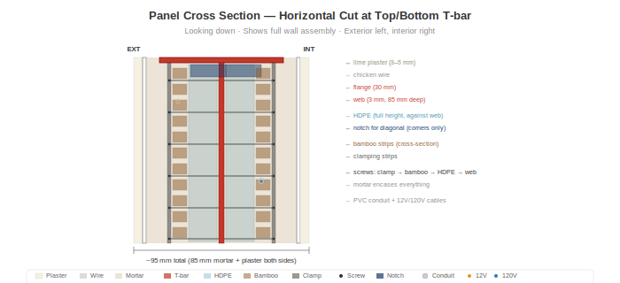

# Anatomie du panneau

## Vue d'ensemble

Chaque panneau mural mesure **1,0 m de large x 2,5 m de haut** (orientation verticale), pese environ **155 kg**, et contient une structure integree, une isolation et des systemes electriques. Une seule taille. Quatre variantes. Entierement prefabrique en atelier, transporte sur site, boulonne dans une ossature metallique de batiment.

> **Evolutivite :** La hauteur de 2,5 m convient aux hauteurs de plafond residentielles standard dans le monde entier. Le systeme s'adapte a toute hauteur -- 3,0 m pour les hauts plafonds, 2,7 m pour les espaces commerciaux, 2,0 m pour les cloisons. Seuls les profiles en T verticaux et les lattes de bambou changent de longueur. Le gabarit de cadre, le systeme de serrage, le procede de mortier et la disposition electrique restent identiques.

## Cadre : profile en T 30x30x3 mm

Le cadre du panneau est un profile en T en acier galvanise a chaud :

- **Aile :** 30 mm de large x 3 mm d'epaisseur -- orientee vers l'exterieur, affleurant la surface du mortier
- **Ame :** 3 mm d'epaisseur -- s'etend vers l'interieur, fournit la profondeur structurelle et la surface de serrage
- **Profiles en T haut/bas :** ame de 85 mm de hauteur (profondeur structurelle horizontale)
- **Profiles en T lateraux :** ame de 30 mm de hauteur
- **Angles :** Soudes dans un gabarit -- tous les cadres sont identiques
- **Trous de serrage :** Perces tous les 10 cm le long des ames superieure et inferieure

Le cadre est l'epine dorsale structurelle. Tout le reste s'y fixe.

## Blocs d'espacement en PEHD

- **Dimensions :** section de 30 x 30 mm, sur toute la largeur de 1 m
- **Position :** Montes sur les ames des profiles en T superieur et inferieur (2 par panneau)
- **Fonction :** Espacent les lattes de bambou de 30 mm par rapport a l'ame en haut et en bas
- **Encoches d'angle :** Decoupes de 10 x 10 mm a chaque coin pour ancrer les lattes diagonales au niveau de l'ame
- **Materiau :** PEHD recycle (a partir de plaques ou de tubes). Zero pourriture, zero corrosion, dimensionnellement stable

## Lattes verticales en guadua

- **Materiau :** Guadua angustifolia traitee au borate, fendue en lattes
- **Dimensions :** ~20 mm de large x 2 500 mm de long
- **Espacement :** ~20 mm entre les lattes (penetration du mortier)
- **Quantite :** ~27 lattes par face, ~54 au total par panneau
- **Fixation :** Serrees par vis sur l'ame du profile en T en haut et en bas via des bandes de serrage

### Le profil )(

En haut et en bas, les blocs en PEHD maintiennent les lattes a 30 mm de l'ame. A mi-hauteur, les lattes flechissent naturellement vers l'interieur en direction de l'ame -- creant un profil en section **)(** . Ce n'est pas un defaut ; c'est le concept :

- Le mortier remplit l'espace variable, creant une forme d'arc naturel
- L'arc resiste aux forces hors plan (vent, impact)
- Le mortier d'epaisseur variable bloque mecaniquement les lattes

## Lattes diagonales en bambou

- **Dimensions :** 60 x 20 mm, ~2 690 mm de long (diagonale de coin a coin)
- **Quantite :** 1 par face, depuis des coins opposes (forme un X vu de face)
- **Position :** Placee au niveau de l'ame, passee dans les encoches d'angle des blocs en PEHD
- **Pre-tendue :** Tiree fermement avant fixation
- **Fonction :** Convertit les efforts sismiques de cisaillement en traction dans la diagonale. Apporte une **amelioration de 3 a 5 fois de la resistance au contreventement** par rapport aux panneaux sans diagonales.

### Ligatures en fil metallique

Ligatures en fil galvanise a chaque croisement diagonale-verticale (~8-10 par face). Elles verrouillent les lattes verticales et diagonales en une grille rigide, repartissant les charges ponctuelles sur toute la surface du panneau et creant un mode de rupture ductile.

## Gaine PVC

- **Taille :** Gaine electrique standard de 16 mm
- **Position :** Entre les lattes de bambou, contre l'ame
- **Fonction :** Protege les cables 12V et 120V du mortier et de la pression des vis. Permet le remplacement des cables en tirant de nouveaux fils sans ouvrir le panneau.

## Systemes electriques

Chaque panneau contient deux circuits independants :

### Eclairage 12V
- Cable bipolaire en gaine PVC
- 6 douilles E10 a vis (3 par face) pres du haut du panneau
- Ampoules a incandescence ou LED blanc chaud (0,5-1W chacune) -- eclairage mural par projection
- Connecteurs rapides 2 broches aux deux bords verticaux

### Secteur 120V (selon variante)
- Cable tripolaire (P + N + T) en gaine PVC
- Connecteurs rapides 3 broches aux deux bords verticaux
- Lorsque les panneaux sont boulonnes cote a cote, les connecteurs s'enclenchent = circuit continu

## Variantes de panneau

| Type | Part | Contenu |
|------|------|---------|
| **P** -- Passage | ~60% | Eclairage 12V + cable de passage 120V. Pas de prises. |
| **O** -- Prise | ~18% | Eclairage 12V + prise double a ~40 cm de hauteur |
| **S** -- Interrupteur + Prise | ~9% | Eclairage 12V + interrupteur a ~120 cm + prise a ~40 cm |
| **W** -- Eau + Prise | ~13% | Eclairage 12V + prise + colonnes montantes eau chaude/froide + evacuation eaux grises |

Toutes les variantes partagent le meme cadre, le meme remplissage en bambou, le meme mortier. Seuls les equipements integres different.

## Mortier

- **Dosage :** 1:4 ciment Portland : sable de riviere propre
- **Additifs :** Fibre de polypropylene (6-12 mm) pour la prevention des fissures de retrait + adjuvant pouzzolanique (cendre volcanique, cendre de balle de riz ou metakaolin)
- **Application :** Coule sur table vibrante (voir [Processus de construction](04-processus-construction.md))
- **Epaisseur totale du mur :** ~85 mm (mortier + guadua + mortier)
- **La pouzzolane** reduit le pH du mortier au fil du temps, ralentissant la degradation du bambou enrobe

## Couches de finition (appliquees sur site apres installation)

1. **Grillage a poule** -- grillage hexagonal galvanise (ouverture de 25 mm), agrafe sur les deux faces. Fournit un accrochage mecanique pour l'adherence du mortier/enduit.
2. **Grillage fin en aluminium** (optionnel) -- moustiquaire standard anti-insectes/poussieres, ouverture de 1-1,5 mm. Bloque insectes, poussieres fines et pollen. Comme propriete secondaire, la couche d'aluminium fournit egalement une attenuation mesurable des radiofrequences.
3. **Enduit a la chaux** -- 3-5 mm, applique a la truelle. Respirant, antifongique, auto-cicatrisant. Optionnel : fibre d'herbe sechee hachee pour la resistance aux fissures.
4. **Badigeon de chaux** -- chaux + eau, applique au pinceau. Finition mate et douce. Chaque coup de pinceau est unique.

## Repartition du poids (approximatif)

| Composant | Poids |
|-----------|-------|
| Ossature en acier | ~18 kg |
| Blocs en PEHD | ~1 kg |
| Lattes de bambou + diagonales | ~12 kg |
| Mortier (85 mm x 1 m x 2,5 m) | ~120 kg |
| Fil, grillage, gaine, cables | ~6 kg |
| **Total** | **~155 kg** |

Porte par 3 a 4 personnes a l'aide d'un simple gabarit de transport.
