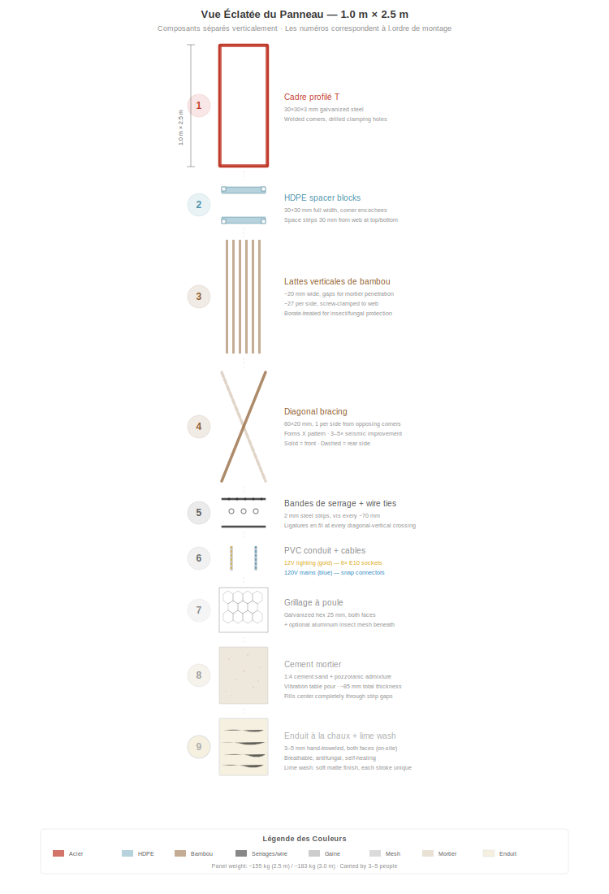
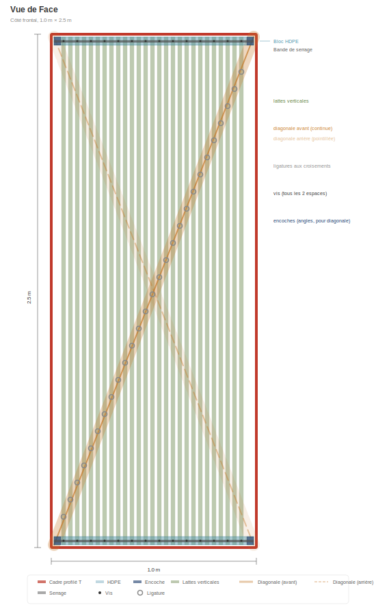
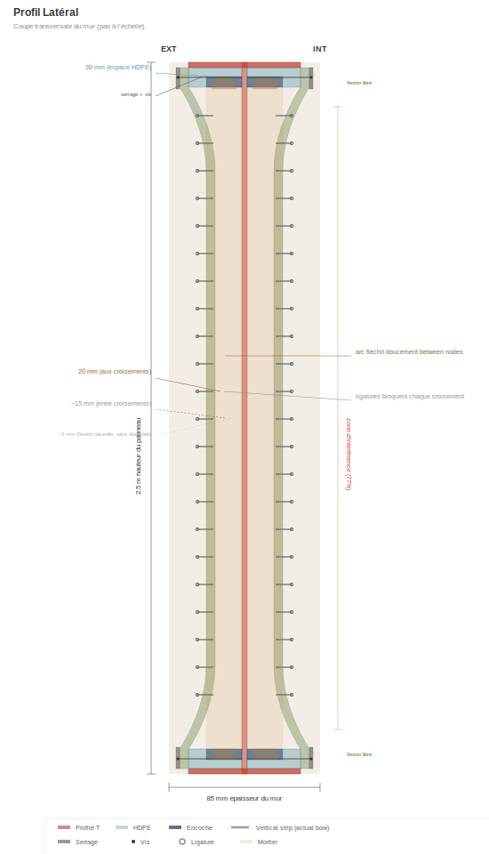
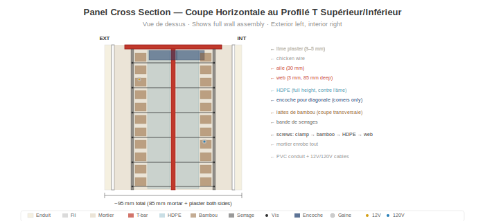

# Anatomie du panneau

> **Mise a jour SVG en attente :** certains diagrammes de ce chapitre passent de l'ancienne specification de profile en T a la specification actuelle de **corniere L 40x40x4 mm**. Certains SVG specifiques au profile en T ont ete temporairement supprimes en attendant leur regeneration. Voir [`SVG-STATUS.md`](../SVG-STATUS.md) a la racine du depot pour la liste complete de regeneration des SVG.

## Vue d'ensemble

Chaque panneau mural mesure **1,0 m de large x 2,5 m de haut** (orientation verticale). Le poids du panneau depend de la phase de production : un **assemblage a sec** (cadre + bambou + grillage + equipements, avant coulage du mortier) pese environ **~75 kg** et c'est la forme livree de l'atelier au chantier pour le coulage du mortier in situ. Une fois le mortier coule, durci et les finitions appliquees sur place (enduit, badigeon de chaux) :

- **Poids de base du mur fini :** environ **~440 kg** par panneau (~ 176 kg/m²) avec le melange standard documente (30 % de teneur en guadua dans la cavite + mortier ciment-sable + 10 mm d'enduit a la chaux sur les deux faces).
- **Melange bahareque optimise :** environ **~360 kg** par panneau (~ 144 kg/m²) avec mortier a la chaux pouzzolanique et fibres de pasto estrella + 30 % de guadua + 5 mm d'enduit a la chaux sur les deux faces. Pratique traditionnelle du bahareque colombien transposee au systeme modulaire ; energie grise legerement moindre, cout un peu plus bas, performance structurelle integralement preservee.

Chaque panneau contient une structure portante, une isolation et des systemes electriques integres. Une seule taille. Quatre variantes.

> **Evolutivite :** La hauteur de 2,5 m convient aux hauteurs de plafond residentielles standard dans le monde entier. Le systeme s'adapte a toute hauteur -- 3,0 m pour les hauts plafonds, 2,7 m pour les espaces commerciaux, 2,0 m pour les cloisons. Seuls les cornieres L verticales et les lattes de bambou changent de longueur. Le gabarit de cadre, le systeme de serrage, le procede de mortier et la disposition electrique restent identiques.

## Cadre : corniere L 40x40x4 mm

> _Diagramme du profile du cadre en attente -- regeneration du SVG pour L 40x40x4 pas encore disponible. Voir `SVG-STATUS.md`._

Le cadre du panneau est une corniere L commerciale (profile angulaire a ailes egales lamine a chaud, ASTM A36 / equivalent ICONTEC, galvanise a chaud) :

- **Profile :** L 40x40x4 mm (deux ailes de 40 mm de large, 4 mm d'epaisseur)
- **Une aile (semelle) :** 40 mm x 4 mm -- orientee vers l'exterieur, affleurant la surface du mortier
- **Autre aile (ame) :** 40 mm x 4 mm -- s'etend vers l'interieur, fournit la profondeur structurelle et la surface de serrage des lattes de bambou et du grillage
- **Epaisseur du mur :** ~85 mm (l'ame de la corniere L se trouve dans le noyau de mortier, le mortier remplit ~41 mm de chaque cote du plan de l'ame)
- **Angles :** Coupes en onglet a 45° et soudes dans un gabarit -- tous les cadres identiques. Goussets d'angle optionnels pour rigidite supplementaire
- **Trous de serrage :** Perces tous les ~70 mm le long des ailes superieure et inferieure (un trou pour deux lattes de bambou). Bandes de serrage de bambou (plat 40x3) vissees dans ces trous
- **Disponibilite :** Article courant, disponible mondialement chez tout marchand d'acier majeur. En Colombie : Gerdau Diaco, Aceros Arequipa, Acesco, Ferrasa, Colmena/Sidenal. Stock en barres de 6 m, decoupe a la longueur a la tronconneuse. Pas de fabrication speciale, pas d'ame asymetrique
- **Pourquoi corniere L plutot que profile en T :** Structurellement equivalent pour le cadre noye en permanence dans le mortier (voir [Performance structurelle](05-performance-structurelle.md)), poids d'acier nettement inferieur (~22 kg/panneau contre ~45 kg pour T 60×60×7), cout inferieur, emissions de CO₂ grises inferieures et -- decisif -- disponible comme stock courant au lieu d'une fabrication asymetrique sur mesure

Le cadre est l'epine dorsale structurelle. Tout le reste s'y fixe.

## Blocs d'espacement en PEHD

- **Dimensions :** section de 30 x 30 mm, sur toute la largeur de 1 m
- **Position :** Montes sur les ames des cornieres L superieure et inferieure (2 par panneau)
- **Fonction :** Espacent les lattes de bambou de 30 mm par rapport a l'ame en haut et en bas
- **Encoches d'angle :** Decoupes de 10 x 10 mm a chaque coin pour ancrer les lattes diagonales au niveau de l'ame
- **Materiau :** PEHD recycle (a partir de plaques ou de tubes). Zero pourriture, zero corrosion, dimensionnellement stable

## Lattes verticales en guadua

- **Materiau :** Guadua angustifolia traitee au borate, fendue en lattes
- **Dimensions :** ~20 mm de large x 2 500 mm de long
- **Espacement :** ~20 mm entre les lattes (penetration du mortier)
- **Quantite :** ~27 lattes par face, ~54 au total par panneau
- **Fixation :** Serrees par vis sur l'ame de la corniere L en haut et en bas via des bandes de serrage

### Le profil )(

En haut et en bas, les blocs en PEHD maintiennent les lattes a 30 mm de l'ame. A mi-hauteur, les lattes flechissent naturellement vers l'interieur en direction de l'ame -- creant un profil en section **)(** . Ce n'est pas un defaut ; c'est le concept :

- Le mortier remplit l'espace variable, creant une forme d'arc naturel
- L'arc resiste aux forces hors plan (vent, impact)
- Le mortier d'epaisseur variable bloque mecaniquement les lattes

## Lattes diagonales en bambou

- **Dimensions :** 60 x 20 mm, ~2 690 mm de long (diagonale de coin a coin)
- **Quantite :** 1 par face, depuis des coins opposes (forme un X vu de face)
- **Position :** Placee au niveau de l'ame, passee dans les encoches d'angle des blocs en PEHD
- **Pre-tendue :** Tiree fermement avant fixation
- **Fonction :** Convertit les efforts sismiques de cisaillement en traction dans la diagonale. Apporte une **amelioration de 3 a 5 fois de la resistance au contreventement** par rapport aux panneaux sans diagonales.

### Ligatures en fil metallique

Ligatures en fil galvanise a chaque croisement diagonale-verticale (~8-10 par face). Elles verrouillent les lattes verticales et diagonales en une grille rigide, repartissant les charges ponctuelles sur toute la surface du panneau et creant un mode de rupture ductile.

## Gaine PVC

- **Taille :** Gaine electrique standard de 16 mm
- **Position :** Entre les lattes de bambou, contre l'ame
- **Fonction :** Protege les cables 12V et 120V du mortier et de la pression des vis. Permet le remplacement des cables en tirant de nouveaux fils sans ouvrir le panneau.

## Systemes electriques

Chaque panneau contient deux circuits independants :

### Eclairage 12V
- Cable bipolaire en gaine PVC
- 6 douilles E10 a vis (3 par face) pres du haut du panneau
- Ampoules a incandescence ou LED blanc chaud (0,5-1W chacune) -- eclairage mural par projection
- Connecteurs rapides 2 broches aux deux bords verticaux

### Secteur 120V (selon variante)
- Cable tripolaire (P + N + T) en gaine PVC
- Connecteurs rapides 3 broches aux deux bords verticaux
- Lorsque les panneaux sont boulonnes cote a cote, les connecteurs s'enclenchent = circuit continu

## Variantes de panneau

| Type | Part | Contenu |
|------|------|---------|
| **P** -- Passage | ~60% | Eclairage 12V + cable de passage 120V. Pas de prises. |
| **O** -- Prise | ~18% | Eclairage 12V + prise double a ~40 cm de hauteur |
| **S** -- Interrupteur + Prise | ~9% | Eclairage 12V + interrupteur a ~120 cm + prise a ~40 cm |
| **W** -- Eau + Prise | ~13% | Eclairage 12V + prise + colonnes montantes eau chaude/froide + evacuation eaux grises |

Toutes les variantes partagent le meme cadre, le meme remplissage en bambou, le meme mortier. Seuls les equipements integres different.

## Mortier

- **Dosage :** 1:4 ciment Portland : sable de riviere propre
- **Additifs :** Fibre de polypropylene (6-12 mm) pour la prevention des fissures de retrait + adjuvant pouzzolanique (cendre volcanique, cendre de balle de riz ou metakaolin)
- **Application :** Coule sur table vibrante (voir [Processus de construction](04-processus-construction.md))
- **Epaisseur totale du mur :** ~85 mm (mortier + guadua + mortier)
- **La pouzzolane** reduit le pH du mortier au fil du temps, ralentissant la degradation du bambou enrobe

## Couches de finition (appliquees sur site apres installation)

1. **Grillage a poule** -- grillage hexagonal galvanise (ouverture de 25 mm), agrafe sur les deux faces. Fournit un accrochage mecanique pour l'adherence du mortier/enduit.
2. **Grillage fin en aluminium** (optionnel) -- moustiquaire standard anti-insectes/poussieres, ouverture de 1-1,5 mm. Bloque insectes, poussieres fines et pollen. Comme propriete secondaire, la couche d'aluminium fournit egalement une attenuation mesurable des radiofrequences.
3. **Enduit a la chaux** -- 3-5 mm, applique a la truelle. Respirant, antifongique, auto-cicatrisant. Optionnel : fibre d'herbe sechee hachee pour la resistance aux fissures.
4. **Badigeon de chaux** -- chaux + eau, applique au pinceau. Finition mate et douce. Chaque coup de pinceau est unique.

## Repartition du poids (approximatif)

| Composant | Poids |
|-----------|-------|
| Ossature en acier | ~22 kg |
| Blocs en PEHD | ~1 kg |
| Lattes de bambou + diagonales | ~38 kg |
| Mortier (cavite ~0,147 m³, durci) | ~294 kg |
| Fil, grillage, gaine, cables | ~6 kg |
| Enduit a la chaux (10 mm les deux faces) | ~100 kg |
| **Total panneau fini, melange de base** | **~460 kg** |

Pour le melange bahareque optimise (chaux pouzzolanique + pasto estrella + enduit 5 mm) : ~380 kg fini. Poids d'expedition de l'assemblage a sec (avant coulage) : ~75 kg, portable par 2 personnes avec une simple sangle.
