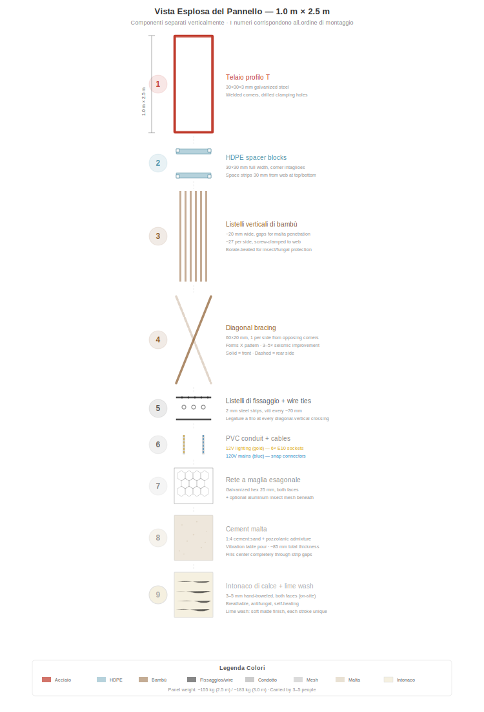
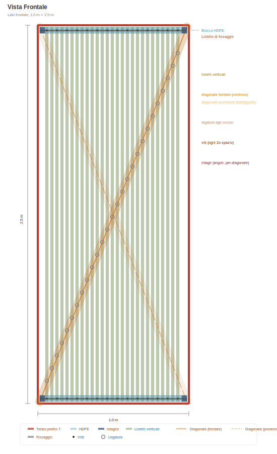
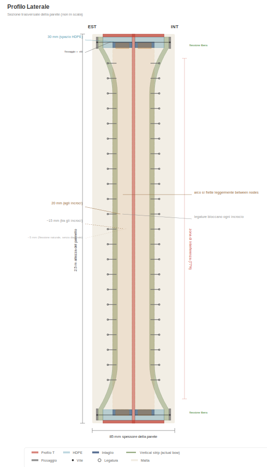
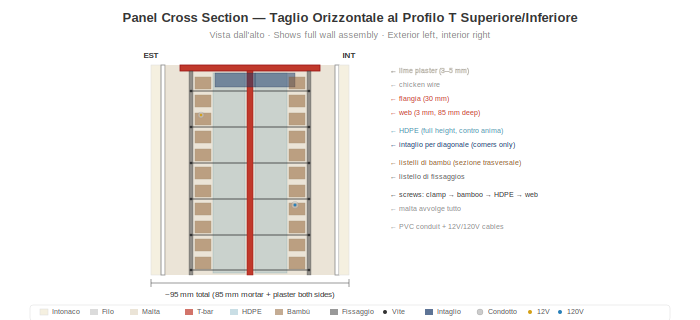

# Anatomia del Pannello

> **Aggiornamento SVG in sospeso:** alcuni diagrammi di questo capitolo passano dalla precedente specifica del angolare L alla specifica attuale di **angolare L 40×40×4 mm**. Alcuni SVG specifici del angolare L sono stati temporaneamente rimossi in attesa di rigenerazione. Vedere [`SVG-STATUS.md`](../SVG-STATUS.md) nella radice del repository per l'elenco completo di rigenerazione SVG.

## Panoramica

Ogni pannello di parete misura **1,0 m di larghezza × 2,5 m di altezza** (orientamento verticale). Il peso del pannello dipende dalla fase di produzione: un **assemblaggio a secco** (telaio + bambù + rete + impianti, prima del getto della malta) pesa circa **~75 kg** ed è la forma in cui viene consegnato dal laboratorio al cantiere per il getto della malta in opera. Una volta gettata la malta, maturata e applicate le finiture in opera (intonaco, latte di calce):

- **Peso base della parete finita:** circa **~440 kg** per pannello (≈ 176 kg/m²) con la miscela standard documentata (30 % di guadua nella cavità + malta cemento-sabbia + 10 mm di intonaco di calce su entrambi i lati).
- **Miscela bahareque ottimizzata:** circa **~360 kg** per pannello (≈ 144 kg/m²) con malta a base di calce pozzolanica e fibre di pasto estrella + 30 % di guadua + 5 mm di intonaco di calce su entrambi i lati. Pratica tradizionale del bahareque colombiano trasferita al sistema modulare; energia grigia leggermente inferiore, costo leggermente inferiore, prestazioni strutturali pienamente preservate.

Ogni pannello contiene struttura, isolamento e impianti elettrici integrati. Una sola misura. Quattro varianti.

> **Scalabilità:** L'altezza di 2,5 m è adatta alle altezze standard dei soffitti residenziali in tutto il mondo. Il sistema si adatta a qualsiasi altezza — 3,0 m per soffitti alti, 2,7 m per spazi commerciali, 2,0 m per tramezze. Cambiano solo gli angolari L verticali e i listelli di bambù. La dima del telaio, il sistema di serraggio, il processo della malta e la disposizione elettrica restano identici.

## Telaio: Angolare L 40×40×4 mm

> _Diagramma del profilo del telaio in sospeso — rigenerazione SVG per L 40×40×4 non ancora disponibile. Vedere `SVG-STATUS.md`._

Il telaio del pannello è un angolare L commerciale (profilo angolare ad ali uguali laminato a caldo, ASTM A36 / equivalente ICONTEC, zincato a caldo):

- **Profilo:** L 40×40×4 mm (entrambe le ali da 40 mm di larghezza, 4 mm di spessore)
- **Un'ala (flangia):** 40 mm × 4 mm — rivolta verso l'esterno, a filo con la superficie della malta
- **Altra ala (anima):** 40 mm × 4 mm — si proietta verso l'interno, fornisce profondità strutturale e superficie di serraggio per listelli di bambù e rete
- **Spessore parete:** ~85 mm (l'anima dell'angolare L si trova nel nucleo di malta, la malta riempie ~41 mm su ciascun lato del piano dell'anima)
- **Angoli:** Tagliati a 45° e saldati in una dima — tutti i telai identici. Cartelle d'angolo opzionali per rigidità aggiuntiva
- **Fori di serraggio:** Forati ogni ~70 mm lungo le anime superiore e inferiore (un foro ogni due listelli di bambù). Listelli di serraggio (piatto 40×3) avvitati in questi fori
- **Disponibilità:** Articolo commerciale, disponibile a livello mondiale presso ogni grande rivenditore di acciaio. In Colombia: Gerdau Diaco, Aceros Arequipa, Acesco, Ferrasa, Colmena/Sidenal. Stock in barre da 6 m, taglio a misura con troncatrice. Nessuna fabbricazione speciale, nessuna anima asimmetrica
- **Perché angolare L invece del angolare L:** Strutturalmente equivalente per il telaio permanentemente annegato nella malta (vedere [Prestazioni Strutturali](05-prestazioni-strutturali.md)), peso d'acciaio significativamente inferiore (~22 kg/pannello rispetto a ~45 kg per T 60×60×7), costo inferiore, emissioni grigie di CO₂ inferiori e — decisivo — disponibile come stock di magazzino invece di fabbricazione asimmetrica su misura

Il telaio è la spina dorsale strutturale. Tutto il resto vi si aggancia.

## Distanziatori in HDPE

- **Dimensione:** sezione di 30 × 30 mm, larghezza piena di 1 m
- **Posizione:** Montati sulle anime dei angolari L superiore e inferiore (2 per pannello)
- **Funzione:** Distanziano i listelli di bambù di 30 mm dall'anima ai bordi superiore e inferiore
- **Intagli angolari:** Incavi di 10 × 10 mm ad ogni angolo che ancorano i listelli diagonali a livello dell'anima
- **Materiale:** HDPE riciclato (da lastra o tubo). Zero marcescenza, zero corrosione, dimensionalmente stabile

## Listelli Verticali di Guadua

- **Materiale:** Guadua angustifolia trattata con borato, spaccata in listelli
- **Dimensioni:** ~20 mm di larghezza × 2.500 mm di lunghezza
- **Spaziatura:** ~20 mm di distanza tra i listelli (penetrazione della malta)
- **Quantità:** ~27 listelli per lato, ~54 totali per pannello
- **Fissaggio:** Serrati a vite all'anima del angolare L in alto e in basso tramite barre di serraggio

### Il Profilo )(

In alto e in basso, i distanziatori in HDPE mantengono i listelli a 30 mm dall'anima. A mezza altezza, i listelli si flettono naturalmente verso l'interno contro l'anima — creando un profilo di sezione trasversale **)(** . Questo non è un difetto; è il progetto:

- La malta riempie lo spazio variabile, creando una forma ad arco naturale
- L'arco resiste alle forze fuori piano (vento, impatto)
- La malta a spessore variabile blocca i listelli meccanicamente

## Listelli Diagonali di Bambù

- **Dimensioni:** 60 × 20 mm, ~2.690 mm di lunghezza (diagonale da angolo ad angolo)
- **Quantità:** 1 per lato, da angoli opposti (forma una X vista frontalmente)
- **Posizione:** Corre a livello dell'anima, infilato attraverso gli intagli angolari dei distanziatori in HDPE
- **Pre-tensionato:** Tirato teso prima del fissaggio
- **Funzione:** Converte le forze di taglio sismiche in trazione nella diagonale. Fornisce un **miglioramento di 3–5 volte nella resistenza al taglio orizzontale** rispetto ai pannelli senza diagonali.

### Legature in Filo Metallico

Legature in filo zincato ad ogni incrocio diagonale-verticale (~8–10 per lato). Bloccano i listelli verticali e diagonali in un reticolo rigido, distribuendo i carichi puntuali su tutta la faccia del pannello e creando una modalità di rottura duttile.

## Tubazione in PVC

- **Dimensione:** tubazione elettrica standard da 16 mm
- **Posizione:** Tra i listelli di bambù, contro l'anima
- **Funzione:** Protegge i cavi 12V e 120V dalla malta e dalla pressione delle viti. Consente la sostituzione dei cavi tirando nuovo filo senza aprire il pannello.

## Impianti Elettrici

Ogni pannello contiene due circuiti indipendenti:

### Illuminazione 12V
- Cavo bipolare in tubazione PVC
- 6× portalampada a vite E10 (3 per lato) nella parte superiore del pannello
- Lampadine a incandescenza calde o LED (0,5–1W ciascuna) — illuminazione a parete
- Connettori a scatto bipolari su entrambi i bordi verticali

### Rete 120V (per variante)
- Cavo tripolare (L + N + T) in tubazione PVC
- Connettori a scatto tripolari su entrambi i bordi verticali
- Quando i pannelli vengono imbullonati adiacenti, i connettori scattano insieme = circuito continuo

## Varianti del Pannello

| Tipo | Quota | Contenuto |
|------|-------|-----------|
| **P** — Passante | ~60% | Illuminazione 12V + cavo passante 120V. Nessuna presa. |
| **O** — Presa | ~18% | Illuminazione 12V + presa doppia a ~40 cm di altezza |
| **S** — Interruttore + Presa | ~9% | Illuminazione 12V + interruttore a ~120 cm + presa a ~40 cm |
| **W** — Acqua + Presa | ~13% | Illuminazione 12V + presa + colonne montanti acqua fredda/calda + scarico acque grigie |

Tutte le varianti condividono lo stesso telaio, lo stesso tamponamento in bambù, la stessa malta. Solo i servizi incorporati differiscono.

## Malta

- **Miscela:** 1:4 cemento Portland : sabbia di fiume pulita
- **Additivi:** Fibra di polipropilene (6–12 mm) per la prevenzione delle fessurazioni in fase di presa + aggiunta pozzolanica (cenere vulcanica, cenere di lolla di riso o metacaolino)
- **Applicazione:** Gettata su tavolo vibrante (vedi [Processo Costruttivo](04-processo-costruttivo.md))
- **Spessore totale della parete:** ~85 mm (malta + guadua + malta)
- **La pozzolana** riduce il pH della malta nel tempo, rallentando il degrado del bambù incorporato

## Strati di Finitura (applicati in cantiere dopo l'installazione)

1. **Rete a maglia esagonale** — rete esagonale zincata (apertura 25 mm), graffettata su entrambe le facce. Fornisce un aggancio meccanico per l'aderenza della malta/intonaco.
2. **Rete fine in alluminio** (opzionale) — rete standard anti-insetti/polvere, apertura 1–1,5 mm. Blocca insetti, polvere fine e polline dall'ingresso attraverso la matrice di malta. Come proprietà secondaria, lo strato di alluminio fornisce anche un'attenuazione misurabile delle radiofrequenze.
3. **Intonaco di calce** — 3–5 mm, applicato a cazzuola. Traspirante, antifungino, autoriparante. Opzionale: fibra di erba essiccata sminuzzata per la resistenza alle fessurazioni.
4. **Latte di calce** — calce + acqua, applicato a pennello. Finitura opaca e morbida. Ogni pennellata è unica.

## Ripartizione del Peso (approssimativa)

| Componente | Peso |
|------------|------|
| Telaio in acciaio (angolare L 40×40×4) | ~22 kg |
| Distanziatori in HDPE | ~1 kg |
| Listelli di bambù + diagonali (~30 % cavità) | ~38 kg |
| Malta del nucleo (cavità ~0,147 m³, indurita) | ~294 kg |
| Filo, rete, tubazione, cavi | ~6 kg |
| Intonaco di calce (10 mm su entrambi i lati) | ~100 kg |
| **Totale pannello finito, miscela base** | **~460 kg** |

Per la miscela bahareque ottimizzata (calce pozzolanica + pasto estrella + intonaco 5 mm): ~380 kg finito. Peso di spedizione dell'assemblaggio a secco (prima del getto): ~75 kg, trasportabile da 2 persone con una semplice fascia.
