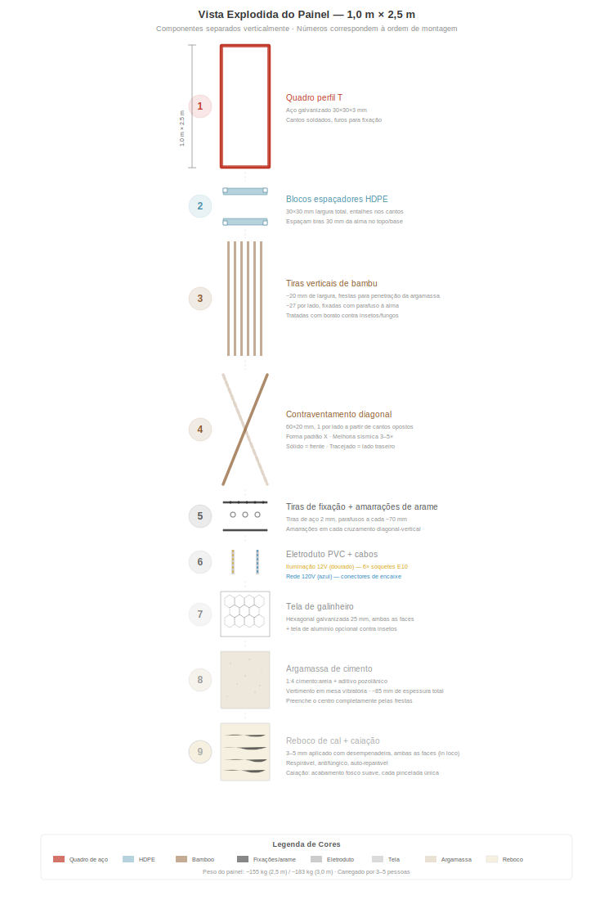
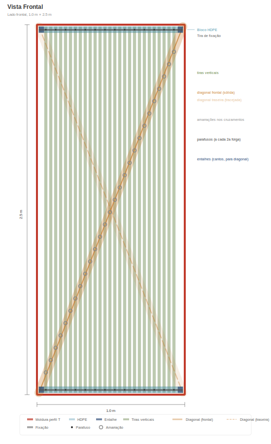
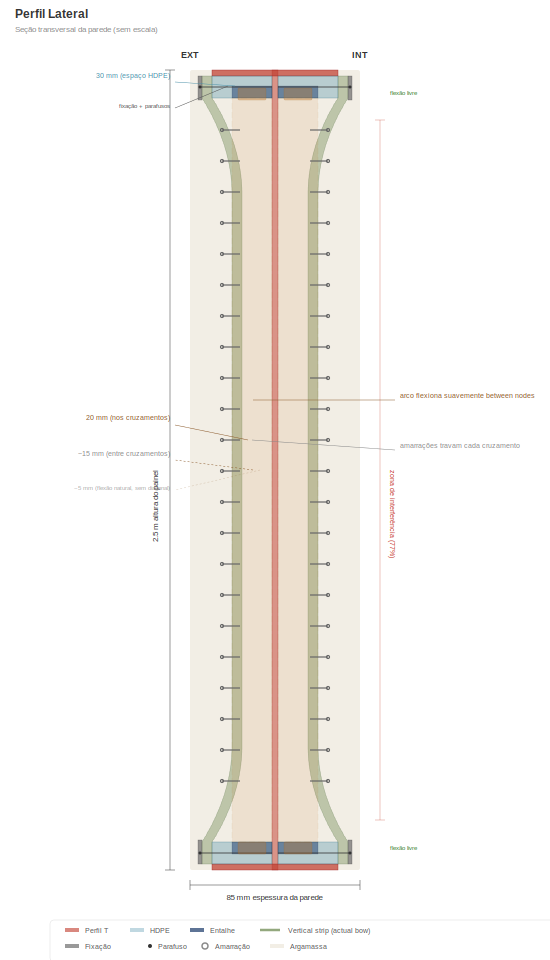
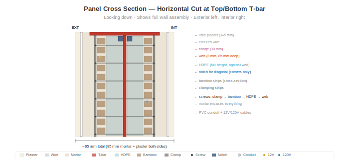

# Anatomia do Painel

> **Atualização de SVG pendente:** alguns diagramas deste capítulo estão migrando da especificação anterior de cantoneira L para a especificação atual de **cantoneira L 40×40×4 mm**. Alguns SVG específicos do cantoneira L foram temporariamente removidos até serem regenerados. Veja [`SVG-STATUS.md`](../SVG-STATUS.md) na raiz do repositório para a lista completa de regeneração de SVG.

## Visão Geral

Cada painel de parede tem **1,0 m de largura × 2,5 m de altura** (orientação vertical). O peso do painel depende da fase de produção: uma **montagem a seco** (estrutura + bambu + tela + instalações, antes do despejo de argamassa) pesa aproximadamente **~75 kg** e é a forma entregue da oficina ao canteiro para o despejo da argamassa in loco. Depois que a argamassa é despejada, curada e os acabamentos in loco aplicados (reboco, caiação):

- **Peso base da parede acabada:** aproximadamente **~440 kg** por painel (≈ 176 kg/m²) com a mistura padrão documentada (30 % de teor de guadua na cavidade + argamassa cimento-areia + 10 mm de reboco de cal nos dois lados).
- **Mistura bahareque otimizada:** aproximadamente **~360 kg** por painel (≈ 144 kg/m²) com argamassa de cal pozolânica com fibras de capim-estrela + 30 % de guadua + 5 mm de reboco de cal nos dois lados. Prática tradicional do bahareque colombiano transposta ao sistema modular; energia incorporada ligeiramente menor, custo um pouco menor, desempenho estrutural plenamente preservado.

Cada painel contém estrutura, isolamento e sistemas elétricos integrados. Um tamanho. Quatro variantes.

> **Escalabilidade:** A altura de 2,5 m é adequada para pés-direitos residenciais padrão no mundo todo. O sistema se adapta a qualquer altura — 3,0 m para pés-direitos altos, 2,7 m para espaços comerciais, 2,0 m para divisórias. Apenas as cantoneiras L verticais e as tiras de bambu mudam de comprimento. O gabarito da estrutura, o sistema de fixação, o processo de argamassa e o layout elétrico permanecem idênticos.

## Estrutura: Cantoneira L 40×40×4 mm

> _Diagrama do perfil da estrutura pendente — regeneração do SVG para L 40×40×4 ainda não disponível. Veja `SVG-STATUS.md`._

A estrutura do painel é uma cantoneira L comercial (perfil angular de abas iguais laminado a quente, ASTM A36 / equivalente ICONTEC, galvanizado a quente):

- **Perfil:** L 40×40×4 mm (ambas as abas com 40 mm de largura, 4 mm de espessura)
- **Uma aba (mesa):** 40 mm × 4 mm — voltada para fora, nivelada com a superfície de argamassa
- **Outra aba (alma):** 40 mm × 4 mm — projeta-se para dentro, proporciona profundidade estrutural e superfície de fixação para tiras de bambu e tela
- **Espessura da parede:** ~85 mm (a alma da cantoneira L fica no núcleo de argamassa, a argamassa preenche ~41 mm de cada lado do plano da alma)
- **Cantos:** Cortados em meia-esquadria a 45° e soldados em gabarito — todas as estruturas idênticas. Cartelas de canto opcionais para rigidez adicional
- **Furos de fixação:** Perfurados a cada ~70 mm ao longo das almas superior e inferior (um furo por cada duas tiras de bambu). Tiras de fixação de bambu (chato 40×3) são parafusadas nesses furos
- **Disponibilidade:** Item comercial, disponível mundialmente em qualquer grande revendedor de aço. Na Colômbia: Gerdau Diaco, Aceros Arequipa, Acesco, Ferrasa, Colmena/Sidenal. Estoque em barras de 6 m, corte na medida com serra-tronco. Sem fabricação especial, sem alma assimétrica
- **Por que cantoneira L em vez de cantoneira L:** Estruturalmente equivalente para a estrutura permanentemente embebida na argamassa (veja [Desempenho Estrutural](05-desempenho-estrutural.md)), peso de aço significativamente menor (~22 kg/painel contra ~45 kg para T 60×60×7), custo menor, emissões de CO₂ incorporado menores e — decisivo — disponível como estoque comum em vez de fabricação assimétrica sob medida

A estrutura é a espinha dorsal do painel. Tudo mais se fixa nela.

## Blocos Espaçadores de PEAD

- **Tamanho:** Seção transversal de 30 × 30 mm, largura total de 1 m
- **Posição:** Montados nas almas dos cantoneiras L superior e inferior (2 por painel)
- **Função:** Espaçam as tiras de bambu 30 mm da alma nas bordas superior e inferior
- **Entalhes nos cantos:** Recortes de 10 × 10 mm em cada canto ancoram as tiras diagonais no nível da alma
- **Material:** PEAD reciclado (de chapa ou tubo). Zero apodrecimento, zero corrosão, dimensionalmente estável

## Tiras Verticais de Guadua

- **Material:** Guadua angustifolia tratada com borato, cortada em tiras
- **Dimensões:** ~20 mm de largura × 2.500 mm de comprimento
- **Espaçamento:** ~20 mm de espaço entre tiras (penetração da argamassa)
- **Quantidade:** ~27 tiras por lado, ~54 no total por painel
- **Fixação:** Fixadas por parafusos à alma do cantoneira L nas partes superior e inferior via tiras de fixação

### O Perfil )(

Nas partes superior e inferior, os blocos de PEAD mantêm as tiras a 30 mm da alma. Na meia-altura, as tiras flexionam naturalmente para dentro em direção à alma — criando um perfil de seção transversal **()**. Isso não é um defeito; é o projeto:

- A argamassa preenche o espaço variável, criando uma forma natural de arco
- O arco resiste a forças fora do plano (vento, impacto)
- A argamassa de espessura variável trava as tiras mecanicamente

## Tiras Diagonais de Bambu

- **Dimensões:** 60 × 20 mm, ~2.690 mm de comprimento (diagonal de canto a canto)
- **Quantidade:** 1 por lado, de cantos opostos (formam um X quando visto de frente)
- **Posição:** Percorre no nível da alma, passando pelos entalhes dos cantos dos blocos de PEAD
- **Pré-tensionada:** Tracionada antes de fixar
- **Função:** Converte forças de cisalhamento sísmico em tração na diagonal. Proporciona **melhoria de 3–5× na resistência ao esforço cortante** em relação a painéis sem diagonais.

### Amarrações de Arame

Amarrações de arame galvanizado em cada cruzamento diagonal-vertical (~8–10 por lado). Essas travam as tiras verticais e diagonais numa grade rígida, distribuindo cargas pontuais por toda a face do painel e criando um modo de falha dúctil.

## Eletroduto de PVC

- **Tamanho:** Eletroduto elétrico padrão de 16 mm
- **Posição:** Entre as tiras de bambu, contra a alma
- **Função:** Protege os cabos de 12V e 120V da argamassa e da pressão dos parafusos. Permite a substituição de cabos puxando novo fio sem abrir o painel.

## Sistemas Elétricos

Cada painel contém dois circuitos independentes:

### Iluminação 12V
- Cabo de 2 condutores em eletroduto de PVC
- 6× soquetes rosca E10 (3 por lado) próximos ao topo do painel
- Lâmpadas incandescentes ou LED branco quente (0,5–1W cada) — iluminação de parede
- Conectores rápidos de 2 pinos em ambas as bordas verticais

### Rede 120V (por variante)
- Cabo de 3 condutores (F + N + T) em eletroduto de PVC
- Conectores rápidos de 3 pinos em ambas as bordas verticais
- Quando painéis são parafusados adjacentes, os conectores se encaixam = circuito contínuo

## Variantes do Painel

| Tipo | Proporção | Conteúdo |
|------|-----------|----------|
| **P** — Passagem | ~60% | Iluminação 12V + cabo de passagem 120V. Sem tomadas. |
| **T** — Tomada | ~18% | Iluminação 12V + tomada dupla a ~40 cm de altura |
| **I** — Interruptor + Tomada | ~9% | Iluminação 12V + interruptor a ~120 cm + tomada a ~40 cm |
| **H** — Hidráulico + Tomada | ~13% | Iluminação 12V + tomada + tubulações de água fria/quente + ralo de esgoto |

Todas as variantes compartilham a mesma estrutura, mesmo preenchimento de bambu, mesma argamassa. Apenas os serviços embutidos diferem.

## Argamassa

- **Traço:** 1:4 cimento Portland : areia de rio limpa
- **Aditivos:** Fibra de polipropileno (6–12 mm) para prevenção de fissuras na fase de cura + aditivo pozolânico (cinza vulcânica, cinza de casca de arroz ou metacaulim)
- **Aplicação:** Vertida em mesa vibratória (ver [Processo Construtivo](04-processo-construtivo.md))
- **Espessura total da parede:** ~85 mm (argamassa + guadua + argamassa)
- **A pozolana** reduz o pH da argamassa ao longo do tempo, retardando a degradação do bambu incorporado

## Camadas de Acabamento (aplicadas no local após a instalação)

1. **Tela de galinheiro** — tela hexagonal galvanizada (abertura de 25 mm), grampeada em ambas as faces. Proporciona aderência mecânica para a argamassa/reboco.
2. **Tela fina de alumínio** (opcional) — tela padrão contra insetos/poeira, abertura de 1–1,5 mm. Bloqueia insetos, poeira fina e pólen de entrar pela matriz de argamassa. Como propriedade secundária, a camada de alumínio também proporciona atenuação mensurável de radiofrequência.
3. **Reboco de cal** — 3–5 mm, aplicado à mão com desempenadeira. Respirável, antifúngico, autorregenerante. Opcional: fibra de capim seco picado para resistência a fissuras.
4. **Caiação** — cal + água, aplicada com broxa. Acabamento fosco suave. Cada pincelada é única.

## Composição do Peso (aproximado)

| Componente | Peso |
|------------|------|
| Estrutura de aço (cantoneira L 40×40×4) | ~22 kg |
| Blocos de PEAD | ~1 kg |
| Tiras de bambu + diagonais (~30 % cavidade) | ~38 kg |
| Argamassa do núcleo (cavidade ~0,147 m³, curada) | ~294 kg |
| Arame, tela, eletroduto, cabos | ~6 kg |
| Reboco de cal (10 mm em ambas as faces) | ~100 kg |
| **Total painel acabado, mistura base** | **~460 kg** |

Para a mistura bahareque otimizada (cal pozolânica + capim-estrela + reboco 5 mm): ~380 kg acabado. Peso de envio da montagem a seco (antes do despejo): ~75 kg, transportável por 2 pessoas com uma cinta simples.
